# Алгоритмы для олимпиадных задач: практическое руководство на Go

## Оглавление

1. [Введение](#глава-1-введение)
2. [Как определить тип задачи](#глава-2-как-определить-тип-задачи)
3. [Ограничения: время и память](#глава-3-ограничения-время-и-память)
4. [Сортировка и бинарный поиск](#глава-4-сортировка-и-бинарный-поиск)
5. [Два указателя и скользящее окно](#глава-5-два-указателя-и-скользящее-окно)
6. [Префиксные суммы и разностные массивы](#глава-6-префиксные-суммы-и-разностные-массивы)
7. [Структуры данных: стек, очередь, куча, DSU](#глава-7-структуры-данных-стек-очередь-куча-dsu)
8. [Деревья отрезков и дерево Фенвика](#глава-8-деревья-отрезков-и-дерево-фенвика)
9. [Жадные алгоритмы](#глава-9-жадные-алгоритмы)
10. [Динамическое программирование](#глава-10-динамическое-программирование)
11. [Графы: обходы и кратчайшие пути](#глава-11-графы-обходы-и-кратчайшие-пути)
12. [Графы: остовные деревья, топология, компоненты](#глава-12-графы-остовные-деревья-топология-компоненты)
13. [Строки: хэши, префикс- и Z-функции](#глава-13-строки-хэши-префикс--и-z-функции)
14. [Комбинаторика и теория чисел](#глава-14-комбинаторика-и-теория-чисел)
15. [Заключение и план подготовки](#глава-15-заключение-и-план-подготовки)

---

## Глава 1. Введение

Эта книга — компактный, но практический конспект по алгоритмам, необходимым для решения
олимпиадных задач по программированию (школьные и студенческие олимпиады, Codeforces,
ACM ICPC, задачи уровня "easy-medium" на LeetCode). Каждая глава посвящена группе
алгоритмов, которая регулярно встречается в задачах, и содержит:

- идею и когда её применять;
- оценку сложности по времени и памяти;
- разбор ключевых деталей и типичных ошибок;
- рабочий пример кода на Go.

Книга не заменяет полноценные учебники (например, "Introduction to Algorithms" Кормена
или CP-algorithms.com), но даёт достаточную базу, чтобы:

1. Быстро **классифицировать** задачу по её условию и ограничениям.
2. **Оценить**, какая сложность алгоритма допустима.
3. **Написать** рабочий код на Go без долгих раздумий над синтаксисом.

### Почему Go для олимпиад

Go не самый популярный язык на олимпиадах (лидируют C++ и Python), но он отлично подходит
для обучения: строгая типизация, простой синтаксис, предсказуемая производительность,
встроенные пакеты `sort`, `container/heap`, `container/list`, `math/bits`. Ниже используются
только возможности стандартной библиотеки.

Стандартный шаблон решения на Go, который стоит держать под рукой:

```go
package main

import (
	"bufio"
	"fmt"
	"os"
)

func main() {
	reader := bufio.NewReaderSize(os.Stdin, 1<<20)
	writer := bufio.NewWriterSize(os.Stdout, 1<<20)
	defer writer.Flush()

	var n int
	fmt.Fscan(reader, &n)

	a := make([]int, n)
	for i := range a {
		fmt.Fscan(reader, &a[i])
	}

	fmt.Fprintln(writer, n)
}
```

**Важно:** `fmt.Scan` без буферизации на больших входных данных (10^5–10^6 чисел) работает
медленно и может не уложиться в лимит времени. Всегда используйте `bufio.Reader` /
`bufio.Writer` — это первая частая причина TLE (Time Limit Exceeded) у новичков на Go.

---

## Глава 2. Как определить тип задачи

Это, пожалуй, самый важный навык на олимпиаде: за 2–3 минуты чтения условия понять, к какому
классу относится задача. Ниже — практический алгоритм анализа условия.

### 2.1. Чек-лист при чтении условия

1. **Что дано и что нужно найти?** Число, массив чисел, граф, строка, набор запросов?
2. **Какие ограничения на размер входа** (n, m, значения элементов)? Это сразу отсекает
   часть алгоритмов (см. главу 3).
3. **Есть ли явная структура графа** — "города и дороги", "серверы и связи", "клетки
   лабиринта"? → графовые алгоритмы.
4. **Есть ли подзадачи, которые пересекаются** ("количество способов", "минимум/максимум
   при условиях", "разбиение на части")? → динамическое программирование.
5. **Просится ли локальное "жадное" решение** ("выбрать лучший вариант на каждом шаге")? —
   но жадность нужно **доказывать**, иначе это ловушка (см. главу 9).
6. **Задача про подстроки/подпоследовательности?** → строковые алгоритмы (хэши,
   префикс-функция, суффиксные структуры).
7. **Есть многократные запросы к одному и тому же массиву** ("сумма на отрезке",
   "минимум на отрезке", с обновлениями)? → дерево отрезков / Фенвик / sparse table.
8. **Нужно проверить/подобрать значение, при этом "если X подходит, то и всё что больше
   (или меньше) X тоже подходит"?** → бинарный поиск по ответу.
9. **Задача про пары/подмассивы с условием на сумму/количество, монотонная зависимость от
   границ окна?** → два указателя / скользящее окно.
10. **Требуется объединять множества, проверять связность, динамически** ("добавили ребро —
    в одной ли компоненте")? → DSU (система непересекающихся множеств).

### 2.2. Таблица "ключевые слова → алгоритм"

| Формулировка в условии | Скорее всего нужно |
|---|---|
| "кратчайший путь", "минимальное число шагов" в невзвешенном графе/сетке | BFS |
| "кратчайший путь" с весами рёбер, все веса ≥ 0 | Дейкстра |
| "кратчайший путь" с отрицательными весами | Беллман–Форд |
| "минимальное связывающее дерево", "минимальная стоимость соединить всё" | MST (Крускал/Прим) |
| "зависимости", "порядок выполнения", "что раньше" | Топологическая сортировка |
| "количество компонент связности", "объединить/проверить одну группу" | DSU / DFS |
| "максимум/минимум с учётом ограничений", "количество способов" | ДП |
| "разбить на подотрезки/подмножества оптимально" | ДП |
| "выбрать максимум непересекающихся", "минимум затрат по порядку" | Жадный алгоритм |
| "подстрока встречается", "сравнить подстроки быстро" | Хэширование строк / Z-функция |
| "циклический сдвиг", "период строки" | Префикс-функция (Z/KMP) |
| "сумма/минимум на отрезке, с обновлениями" | Дерево отрезков / Фенвик |
| "сумма на отрезке без обновлений" | Префиксные суммы |
| "k-я по счёту, ответ монотонен от параметра" | Бинарный поиск по ответу |
| "подотрезок с суммой/условием, окно" | Два указателя |
| "делится на", "простые числа", "НОД/НОК" | Теория чисел |
| "число способов выбрать/расставить" | Комбинаторика |

### 2.3. Ограничения как подсказка

Если явно не сказано, какой алгоритм нужен, **ограничения n почти всегда выдают
асимптотику** (подробно — в главе 3):

- `n ≤ 10` — можно перебрать все перестановки (`O(n!)`) или маски (`O(2^n · n)`).
- `n ≤ 20–22` — битовые маски, `O(2^n · n)`.
- `n ≤ 500–2000` — `O(n^2)` или `O(n^2 log n)`.
- `n ≤ 10^5–10^6` — `O(n log n)`.
- `n ≤ 10^7–10^8` — только `O(n)` или `O(n log log n)` (решето Эратосфена).
- `n` до `10^9` и больше, но ответ ищется по значению — вероятно, бинарный поиск по ответу
  или формула за `O(log n)`.

### 2.4. Пример разбора условия

> "Дан массив из n ≤ 2·10^5 чисел. Обрабатывается q ≤ 2·10^5 запросов двух типов:
> (1) изменить значение элемента, (2) найти сумму на отрезке [l, r]."

Разбор:
- Многократные запросы к одному массиву с обновлениями → дерево отрезков или Фенвик.
- `n, q ~ 2·10^5` → нужен алгоритм `O(log n)` на запрос, наивный `O(n)` на запрос даст
  `4·10^10` операций — точно TLE.
- Итог: Fenwick tree (дерево Фенвика), глава 8.

---

## Глава 3. Ограничения: время и память

### 3.1. Оценка времени через "операции в секунду"

Типичный судья выполняет **10^8–10^9 простых операций в секунду** (Go — обычно ближе к
10^8–5·10^8 из-за накладных расходов рантайма и границ проверки слайсов). Это грубое
правило позволяет быстро прикинуть, впишется ли алгоритм в лимит:

| Сложность | Максимальное n (лимит ~1–2 сек) |
|---|---|
| `O(n!)` | ≤ 10–11 |
| `O(2^n)` | ≤ 20–22 |
| `O(n^3)` | ≤ 300–500 |
| `O(n^2)` | ≤ 5000–10000 |
| `O(n log n)` | ≤ 10^6–10^7 |
| `O(n)` | ≤ 10^7–10^8 |
| `O(log n)` или `O(1)` | n почти не важно |

Правило: **всегда считайте сложность в худшем случае для максимального n из условия**,
подставляйте в таблицу и смотрите, есть ли запас (желателен запас в 5–10 раз, потому что
у судьи наверняка есть накладные расходы: ввод-вывод, аллокации, GC).

### 3.2. Память

Лимит памяти обычно 256 МБ. Прикидка:

- `int` в Go — 8 байт (на 64-битных платформах), `int32` — 4 байта.
- Массив `[]int` длиной `10^7` займёт ~80 МБ — уже близко к лимиту. Если можно, используйте
  `int32` или `[]byte`.
- Матрица `n × n` при `n = 10^4` — это `10^8` ячеек, что при `int` даст 800 МБ — **не
  влезет**. Нужно либо уменьшить размерность, либо хранить разреженно.
- В Go под каждый слайс есть заголовок (указатель, длина, capacity) — 24 байта, а также
  GC добавляет накладные расходы. Для больших объёмов данных выделяйте слайсы сразу нужного
  размера (`make([]int, n)`), а не через `append` в цикле без `cap`.

```go
// Плохо: много переаллокаций и лишней работы GC
var a []int
for i := 0; i < n; i++ {
    a = append(a, i)
}

// Хорошо: сразу известна ёмкость
a := make([]int, 0, n)
for i := 0; i < n; i++ {
    a = append(a, i)
}
```

### 3.3. Практические приёмы ускорения в Go

1. **Ввод-вывод.** Всегда `bufio.NewReader`/`bufio.NewWriter`. При очень большом вводе
   (>10^6 чисел) `fmt.Fscan` всё ещё может быть медленным из-за рефлексии — тогда пишут
   свой быстрый сканер на основе `bufio.Scanner` с ручным парсингом чисел:

```go
var reader *bufio.Reader

func readInt() int {
	n := 0
	c, _ := reader.ReadByte()
	for c == ' ' || c == '\n' || c == '\r' {
		c, _ = reader.ReadByte()
	}
	neg := false
	if c == '-' {
		neg = true
		c, _ = reader.ReadByte()
	}
	for c >= '0' && c <= '9' {
		n = n*10 + int(c-'0')
		c, _ = reader.ReadByte()
	}
	if neg {
		return -n
	}
	return n
}
```

2. **Избегайте лишних аллокаций в горячих циклах.** Создание слайсов/мап внутри вложенного
   цикла — частая причина TLE из-за давления на GC.
3. **Передавайте большие структуры по указателю**, а не по значению, если они копируются
   в цикле.
4. **`map` медленнее слайса.** Если ключи — маленькие целые числа, используйте `[]int`
   вместо `map[int]int`.
5. **Рекурсия глубиной > 10^5** может привести к переполнению стека или сильно замедлить
   работу — для глубокого DFS переписывайте на итеративный вариант со своим стеком.
6. Компилируйте и тестируйте в режиме, близком к боевому: `go build -o sol && ./sol < input.txt`,
   не полагайтесь только на `go run` (он чуть медленнее из-за компиляции на лету, хотя на
   время исполнения это не влияет — важно на этапе локальных замеров).

### 3.4. Быстрая самопроверка перед сдачей

Перед отправкой решения задайте себе три вопроса:
1. Какая асимптотика у моего решения и укладывается ли она в таблицу из 3.1 для
   максимального n?
2. Сколько памяти займут все структуры данных при максимальном n?
3. Учтены ли граничные случаи (n = 0 или 1, пустой массив, отрицательные числа,
   переполнение `int32`)?

---

## Глава 4. Сортировка и бинарный поиск

### 4.1. Сортировка

В большинстве задач сортировка не пишется руками — используется `sort.Slice` (сложность
`O(n log n)`).

```go
package main

import (
	"fmt"
	"sort"
)

func main() {
	a := []int{5, 3, 8, 1, 2}

	sort.Slice(a, func(i, j int) bool { return a[i] < a[j] })
	fmt.Println(a) // [1 2 3 5 8]

	type Point struct{ x, y int }
	pts := []Point{{3, 1}, {1, 5}, {1, 2}}
	sort.Slice(pts, func(i, j int) bool {
		if pts[i].x != pts[j].x {
			return pts[i].x < pts[j].x
		}
		return pts[i].y < pts[j].y
	})
	fmt.Println(pts) // [{1 2} {1 5} {3 1}]
}
```

Для целых чисел быстрее использовать `sort.Ints`, для строк — `sort.Strings` (они не
используют интерфейсную диспетчеризацию так тяжело, как `sort.Slice`, хотя разница обычно
не критична для n ≤ 10^6).

**Как это работает.** `sort.Slice(a, less)` принимает срез и функцию `less(i, j)`,
которая говорит, должен ли элемент с индексом `i` стоять раньше элемента с индексом `j`.
Внутри Go использует комбинированный алгоритм (быстрая сортировка + вставками для мелких
кусков + heapsort как страховку от плохих случаев), поэтому сложность гарантированно
`O(n log n)` даже в худшем случае. Сортировка **неустойчива** — порядок изначально равных
элементов не сохраняется; если это важно, нужен `sort.SliceStable` (та же сигнатура, но
чуть медленнее).

Второй пример в коде — сортировка точек по двум ключам: сначала по `x`, а при равенстве
`x` — по `y`. Это стандартный приём: компаратор сравнивает основной ключ и, если он
совпал, "проваливается" к сравнению следующего по важности ключа. Так же обобщается на
сортировку по трём и более полям.

### 4.2. Бинарный поиск в массиве

Классический бинарный поиск ищет элемент или первую позицию, удовлетворяющую предикату,
за `O(log n)`. В Go есть готовые функции `sort.SearchInts` и `sort.Search`.

```go
package main

import (
	"fmt"
	"sort"
)

func main() {
	a := []int{1, 3, 3, 5, 7, 9}

	// Первый индекс, где a[i] >= 5
	idx := sort.SearchInts(a, 5)
	fmt.Println(idx) // 3

	// Общий случай: sort.Search принимает предикат,
	// который должен быть монотонным (false...false, true...true)
	idx2 := sort.Search(len(a), func(i int) bool { return a[i] >= 6 })
	fmt.Println(idx2) // 4 (первый элемент >= 6, это a[4] = 7)
}
```

**Как это работает.** Массив должен быть отсортирован. Идея — держать отрезок `[lo, hi)`,
внутри которого гарантированно лежит ответ, и на каждом шаге брать середину `mid`,
проверять для неё предикат и отбрасывать ровно половину отрезка: если предикат в `mid`
уже истинен — ответ не правее `mid`, значит `hi = mid`; если ложен — ответ строго правее,
`lo = mid + 1`. Цикл заканчивается, когда `lo == hi` — это и есть первый индекс, где
предикат истинен. Каждая итерация уменьшает отрезок вдвое, отсюда `O(log n)`.

`sort.SearchInts(a, x)` — это частный случай `sort.Search` с предикатом `a[i] >= x`.
`sort.Search` — общая версия: предикат обязан быть монотонным (сначала везде `false`,
потом везде `true`), иначе результат непредсказуем.

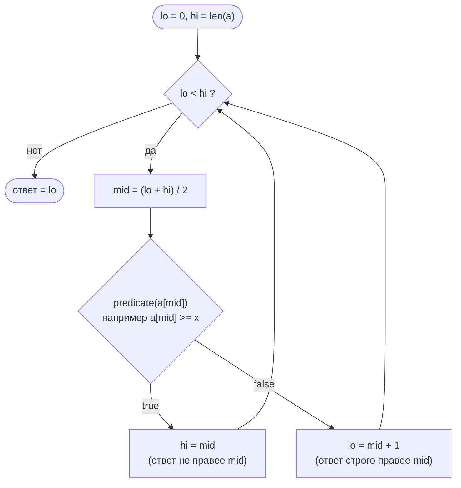
```mermaid
flowchart TD
    Start(["lo = 0, hi = len(a)"]) --> Check{"lo < hi ?"}
    Check -- "нет" --> Done(["ответ = lo"])
    Check -- "да" --> Mid["mid = (lo + hi) / 2"]
    Mid --> Pred{"predicate(a[mid])<br/>например a[mid] >= x"}
    Pred -- "true" --> ShrinkHi["hi = mid<br/>(ответ не правее mid)"]
    Pred -- "false" --> ShrinkLo["lo = mid + 1<br/>(ответ строго правее mid)"]
    ShrinkHi --> Check
    ShrinkLo --> Check
```

### 4.3. Бинарный поиск по ответу

Мощная техника: если можно за `O(f(n))` проверить предикат "подходит ли значение X", а сам
предикат монотонен (при увеличении X ответ не может смениться с "да" на "нет" более одного
раза), то искомое X ищется бинарным поиском по ответу.

**Пример задачи:** "Есть n кусков верёвки заданной длины. Разрешено резать их на части.
Нужно получить k кусков одинаковой длины, максимально возможной. Найти эту длину
(с точностью 1e-6 или как целое число)."

Идея: перебираем длину L бинарным поиском; проверка `canCut(L)` — сколько кусков длины L
получится, если резать все верёвки — суммируем `len[i] / L` и сравниваем с k.

```go
package main

import "fmt"

func canCut(ropes []int, length, k int) bool {
	if length == 0 {
		return true
	}
	count := 0
	for _, l := range ropes {
		count += l / length
	}
	return count >= k
}

// Находит максимальную длину L, такую что canCut(L) == true.
func maxRopeLength(ropes []int, k int) int {
	lo, hi := 0, 0
	for _, l := range ropes {
		if l > hi {
			hi = l
		}
	}
	for lo < hi {
		mid := (lo + hi + 1) / 2 // сдвиг вверх, чтобы не зациклиться
		if canCut(ropes, mid, k) {
			lo = mid
		} else {
			hi = mid - 1
		}
	}
	return lo
}

func main() {
	ropes := []int{8, 4, 5}
	fmt.Println(maxRopeLength(ropes, 5)) // 2
}
```

**Как это работает.** Здесь бинарным поиском ищем не элемент в массиве, а значение
параметра `L` (длину куска) из непрерывного диапазона `[0, max(ropes)]`. Для любого `L`
можно за `O(n)` посчитать `canCut(L)` — хватит ли кусков такой длины. Ключевое свойство:
если при длине `L` кусков хватает, то и при любой меньшей длине `L' < L` их хватит и
подавно (чем короче режем, тем больше кусков получаем) — то есть предикат монотонен:
"true...true...false...false" по мере роста `L`. Это и позволяет применить бинарный
поиск: ищем последнее `L`, при котором `canCut(L) == true`.

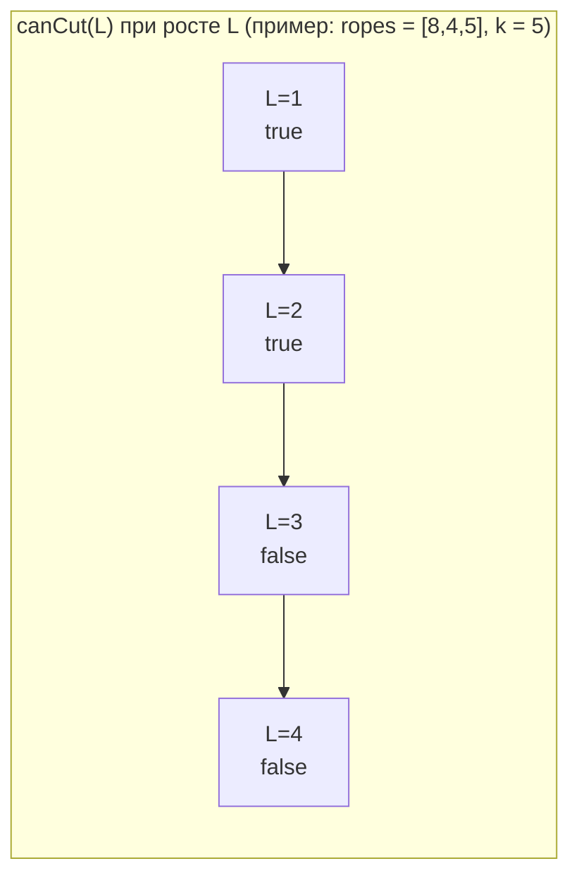
```mermaid
flowchart LR
    subgraph "canCut(L) при росте L (пример: ropes = [8,4,5], k = 5)"
    L1["L=1<br/>true"] --> L2["L=2<br/>true"] --> L3["L=3<br/>false"] --> L4["L=4<br/>false"]
    end
```

Так как ищем **последнее** `true`, а не первое, формула середины и обновление границ
зеркальны по сравнению с 4.2: `mid` округляется вверх (`(lo+hi+1)/2`), а при `true`
двигаем `lo = mid` (не `hi = mid`), иначе `hi = mid - 1`. Это нужно, чтобы при
`lo, hi` соседних (например, `lo=1, hi=2`) `mid` не застревал на `lo` и цикл не завис.

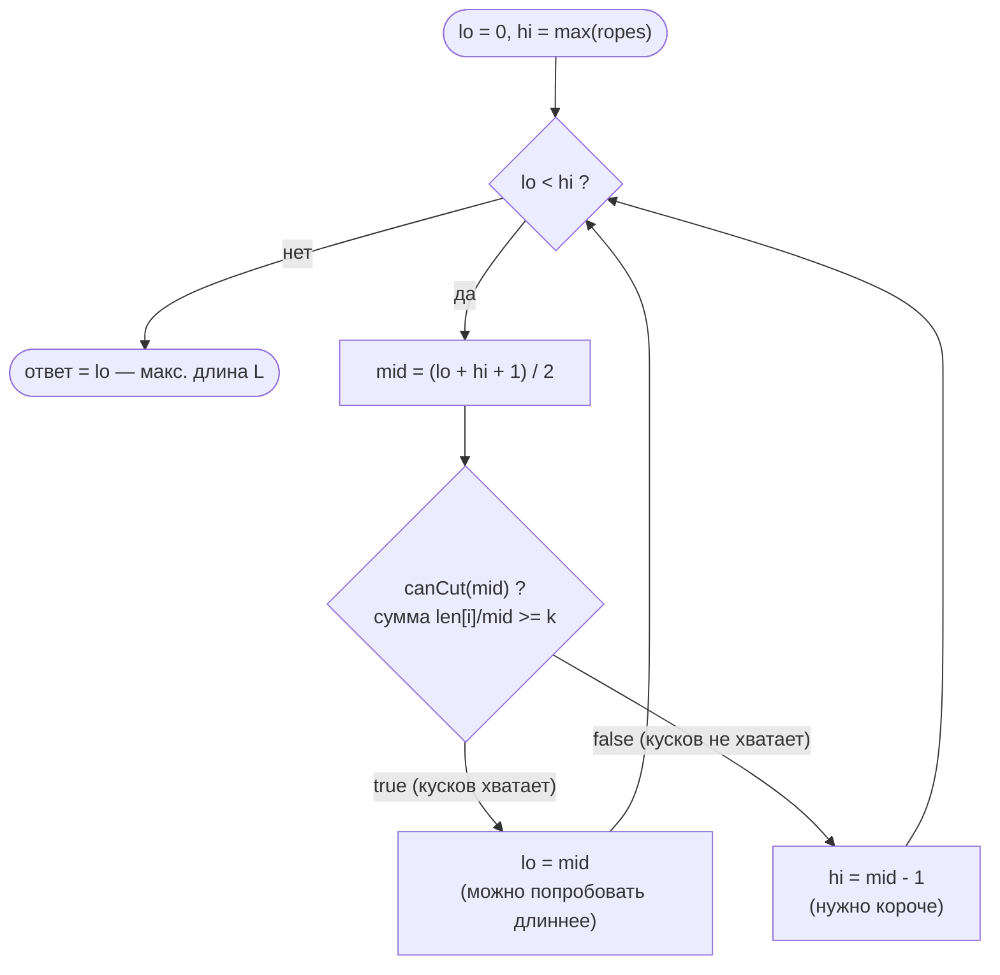
```mermaid
flowchart TD
    Start(["lo = 0, hi = max(ropes)"]) --> Check{"lo < hi ?"}
    Check -- "нет" --> Done(["ответ = lo — макс. длина L"])
    Check -- "да" --> Mid["mid = (lo + hi + 1) / 2"]
    Mid --> Pred{"canCut(mid) ?<br/>сумма len[i]/mid >= k"}
    Pred -- "true (кусков хватает)" --> ShrinkLo["lo = mid<br/>(можно попробовать длиннее)"]
    Pred -- "false (кусков не хватает)" --> ShrinkHi["hi = mid - 1<br/>(нужно короче)"]
    ShrinkLo --> Check
    ShrinkHi --> Check
```

**Ключевые детали бинарного поиска:**
- Определитесь заранее, что ищете: первое `true` или последнее `true` — от этого зависит
  формула середины (`mid = (lo+hi)/2` vs `mid = (lo+hi+1)/2`) и обновление границ, иначе
  будет бесконечный цикл.
- Всегда проверяйте границы `lo` и `hi` на корректность (например, `hi` должен быть
  заведомо достижимым или заведомо недостижимым значением).

---

## Глава 5. Два указателя и скользящее окно

Используется, когда нужно обработать все подотрезки массива/строки, а условие "растёт"
монотонно с расширением окна и монотонно "ослабевает" при сужении. Позволяет свести
`O(n^2)` перебор к `O(n)`.

### 5.1. Классическая задача: минимальная длина подотрезка с суммой ≥ S

```go
package main

import "fmt"

func minSubArrayLen(target int, nums []int) int {
	n := len(nums)
	best := n + 1
	sum := 0
	left := 0
	for right := 0; right < n; right++ {
		sum += nums[right]
		for sum >= target {
			if right-left+1 < best {
				best = right - left + 1
			}
			sum -= nums[left]
			left++
		}
	}
	if best == n+1 {
		return 0 // подходящего подотрезка нет
	}
	return best
}

func main() {
	fmt.Println(minSubArrayLen(7, []int{2, 3, 1, 2, 4, 3})) // 2 ([4,3])
}
```

Сложность: `O(n)`, потому что `left` и `right` суммарно двигаются вперёд не более `2n` раз.

**Как это работает.** Указатель `right` жадно расширяет окно вправо, накапливая сумму.
Как только сумма достигает `target`, окно заведомо избыточно — начинаем сжимать его слева
(`left++`), на каждом шаге фиксируя более короткую длину, пока сумма снова не станет
меньше `target`. Ни `left`, ни `right` никогда не двигаются назад, поэтому суммарно они
делают не больше `2n` шагов — отсюда `O(n)` вместо наивного перебора всех подотрезков за
`O(n^2)`.

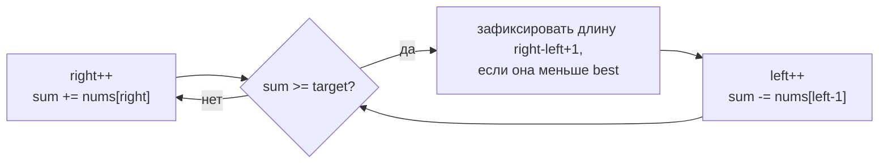
```mermaid
flowchart LR
    A["right++<br/>sum += nums[right]"] --> B{"sum >= target?"}
    B -- "нет" --> A
    B -- "да" --> C["зафиксировать длину right-left+1,<br/>если она меньше best"]
    C --> D["left++<br/>sum -= nums[left-1]"]
    D --> B
```

### 5.2. Два указателя с разных концов (задача о паре с заданной суммой)

Работает на **отсортированном** массиве.

```go
func twoSumSorted(a []int, target int) (int, int) {
	i, j := 0, len(a)-1
	for i < j {
		s := a[i] + a[j]
		if s == target {
			return i, j
		} else if s < target {
			i++
		} else {
			j--
		}
	}
	return -1, -1
}
```

**Как это работает.** `i` стоит на минимальном элементе, `j` — на максимальном. Если их
сумма меньше `target`, единственный способ её увеличить — взять элемент побольше, то есть
сдвинуть `i` вправо (сдвигать `j` влево бессмысленно — сумма только уменьшится). Если сумма
больше `target` — симметрично сдвигаем `j` влево. За счёт отсортированности каждый шаг
однозначно определён, указатели идут навстречу друг другу и суммарно делают не больше `n`
шагов — `O(n)` вместо `O(n^2)` перебора всех пар.

### 5.3. Когда НЕ применимы два указателя

Если условие не монотонно относительно расширения/сужения окна (например, "сумма должна
быть ровно чётной и содержать не более двух отрицательных чисел одновременно" — сложная
немонотонная логика), два указателя не гарантируют корректность. В таких случаях нужно ДП
или дерево отрезков.

### 5.4. Амортизированный поиск ближайшего элемента (указатель "с памятью")

Иногда для каждого индекса `i` нужно найти **ближайший подходящий** индекс `j > i`, но
условие "подходит ли `j`" в процессе не меняется, а искать каждый раз заново с начала —
`O(n)` на индекс и `O(n^2)` суммарно. Хитрость (использованная, например, в решении задачи
Codeforces 1114C о преобразовании битовой строки `A` в `B` обменом пар символов) — завести
отдельный указатель поиска, который **никогда не двигается назад**, и продолжать поиск от
него, а не с начала:

```go
package main

import "fmt"

// matchNearest пытается сделать a[i] == b[i] для всех i из группы
// (start, start+stride, start+2*stride, ...), переставляя элементы a
// внутри этой группы. При рассогласовании a[i] != b[i] ищет ближайшего
// справа "донора" — позицию j той же группы, где a[j] уже равно
// нужному значению b[i], и меняет местами a[i] и a[j].
func matchNearest(a, b []int, start, stride int) bool {
	searchFrom := start
	for i := start; i < len(a); i += stride {
		if a[i] == b[i] {
			continue // уже совпадает — идём к следующей позиции группы
		}
		want := b[i]
		if searchFrom < i+stride {
			searchFrom = i + stride
		}
		for searchFrom < len(a) && a[searchFrom] != want {
			searchFrom += stride
		}
		if searchFrom >= len(a) {
			return false
		}
		a[i], a[searchFrom] = a[searchFrom], a[i]
	}
	return true
}

func main() {
	a := []int{1, 1, 0, 1, 1, 1, 0, 1} // чётные позиции (0,2,4,6): 1,0,1,0
	b := []int{0, 1, 1, 1, 0, 1, 1, 1} // хотим на чётных позициях: 0,1,0,1
	fmt.Println(matchNearest(a, b, 0, 2)) // true
	fmt.Println(a)                        // [0 1 1 1 0 1 1 1]
}
```

**Как это работает.** Указатель `searchFrom` для конкретного `start` двигается только вправо
и никогда не сбрасывается к началу. За весь внешний цикл по `i` он проходит по массиву не
более одного раза целиком (либо стоит на месте, либо растёт), поэтому суммарное число шагов
внутреннего цикла по всем итерациям внешнего — `O(n)`, а не `O(n^2)`, хотя код выглядит как
вложенные циклы. Это тот же приём амортизации, что и у двух указателей (5.1–5.2), но
применённый не к скользящему окну, а к задаче "найти ближайший элемент по требованию".

**Когда применять:** задачи вида "переставить/поменять элементы местами, минимизируя
суммарное расстояние", где корректна **жадная** стратегия "бери ближайшего подходящего
кандидата" (обосновывается обменным аргументом: более дальний обмен всегда можно заменить на
более близкий без потери корректности и без увеличения стоимости).

---

## Глава 6. Префиксные суммы и разностные массивы

### 6.1. Префиксные суммы — сумма на отрезке за O(1)

Если массив статичен (без обновлений), а запросов "сумма на отрезке [l, r]" много,
предпосчитываем префиксные суммы за `O(n)`, каждый запрос — `O(1)`.

```go
package main

import "fmt"

type PrefixSum struct {
	pre []int64
}

func NewPrefixSum(a []int) *PrefixSum {
	pre := make([]int64, len(a)+1)
	for i, v := range a {
		pre[i+1] = pre[i] + int64(v)
	}
	return &PrefixSum{pre: pre}
}

// Sum возвращает сумму a[l..r] включительно (0-индексация).
func (p *PrefixSum) Sum(l, r int) int64 {
	return p.pre[r+1] - p.pre[l]
}

func main() {
	a := []int{1, 2, 3, 4, 5}
	ps := NewPrefixSum(a)
	fmt.Println(ps.Sum(1, 3)) // 2+3+4 = 9
}
```

Аналогично строятся 2D-префиксные суммы для матриц (сумма на прямоугольнике за `O(1)`).

**Как это работает.** `pre[i]` хранит сумму первых `i` элементов исходного массива
(`pre[0] = 0`). Тогда сумма отрезка `[l, r]` — это "всё до `r+1`" минус "всё до `l`":
`pre[r+1] - pre[l]`, потому что общая часть `[0, l)` сокращается. Единственная
предобработка — один проход `O(n)` для построения `pre`, после чего любой запрос суммы
отвечает за `O(1)` вместо пересчёта отрезка каждый раз за `O(n)`.

### 6.2. Разностный массив — массовое обновление отрезка за O(1)

Обратная задача: нужно много раз прибавить значение ко **всем элементам отрезка**, а
прочитать финальный массив — один раз в конце.

```go
package main

import "fmt"

// RangeAdd прибавляет val к diff[l..r], после всех обновлений
// восстановить массив можно префиксной суммой diff.
func RangeAdd(diff []int, l, r, val int) {
	diff[l] += val
	if r+1 < len(diff) {
		diff[r+1] -= val
	}
}

func Restore(diff []int) []int {
	res := make([]int, len(diff))
	res[0] = diff[0]
	for i := 1; i < len(diff); i++ {
		res[i] = res[i-1] + diff[i]
	}
	return res
}

func main() {
	n := 6
	diff := make([]int, n)
	RangeAdd(diff, 1, 3, 5) // прибавить 5 к a[1..3]
	RangeAdd(diff, 0, 5, 1) // прибавить 1 ко всем
	fmt.Println(Restore(diff)) // [1 6 6 6 1 1]
}
```

Если нужны и обновления отрезка, и запросы на отрезке одновременно (не батчами, а
вперемешку) — используйте дерево отрезков с ленивым распространением (глава 8).

**Как это работает.** Это приём, обратный префиксным суммам. Вместо того чтобы прибавлять
`val` к каждому из `r-l+1` элементов отрезка `[l, r]` (это было бы `O(n)` за одно
обновление), мы отмечаем только границы: `diff[l] += val` ("начиная с `l` добавляется
`val`") и `diff[r+1] -= val` ("после `r` эффект прекращается"). Так каждое обновление
стоит `O(1)`. После того как все обновления сделаны, один проход префиксной суммой по
`diff` "размазывает" эти пометки по всем элементам между границами и восстанавливает
итоговый массив за `O(n)`.

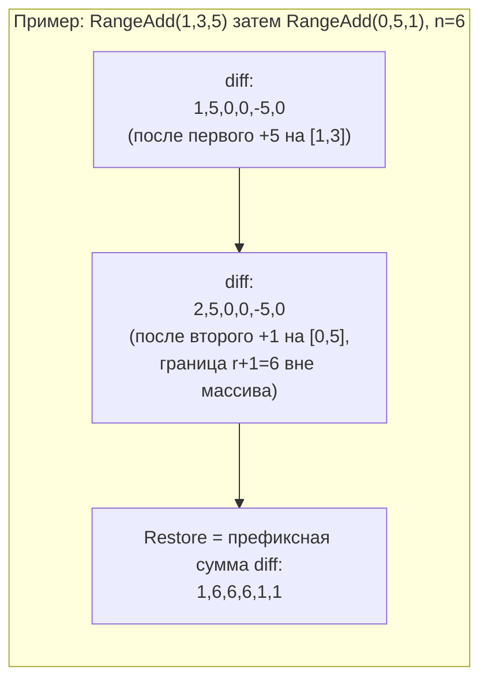
```mermaid
flowchart LR
    subgraph "Пример: RangeAdd(1,3,5) затем RangeAdd(0,5,1), n=6"
    D0["diff:<br/>1,5,0,0,-5,0<br/>(после первого +5 на [1,3])"] --> D1["diff:<br/>2,5,0,0,-5,0<br/>(после второго +1 на [0,5],<br/>граница r+1=6 вне массива)"]
    D1 --> R["Restore = префиксная сумма diff:<br/>1,6,6,6,1,1"]
    end
```

Обновление отрезка — `O(1)`, а восстановление всего массива — `O(n)` один раз в конце.
Это выгодно, когда обновлений много, а прочитать финальный результат нужно только один раз
(или редко) — иначе, при вперемешку идущих обновлениях и запросах, нужно дерево отрезков.

---

## Глава 7. Структуры данных: стек, очередь, куча, DSU

### 7.1. Стек

Стек в Go обычно реализуется через слайс:

```go
stack := []int{}
stack = append(stack, 5)     // push
top := stack[len(stack)-1]   // peek
stack = stack[:len(stack)-1] // pop
```

**Типичная задача:** следующий больший элемент (Next Greater Element) — за `O(n)` с
помощью монотонного стека.

```go
package main

import "fmt"

func nextGreaterElement(a []int) []int {
	n := len(a)
	res := make([]int, n)
	for i := range res {
		res[i] = -1
	}
	stack := make([]int, 0, n) // хранит индексы, a[stack] убывает

	for i := 0; i < n; i++ {
		for len(stack) > 0 && a[stack[len(stack)-1]] < a[i] {
			top := stack[len(stack)-1]
			stack = stack[:len(stack)-1]
			res[top] = a[i]
		}
		stack = append(stack, i)
	}
	return res
}

func main() {
	fmt.Println(nextGreaterElement([]int{2, 1, 2, 4, 3}))
	// [4 2 4 -1 -1]
}
```

**Как это работает.** Стек хранит индексы элементов, для которых "ответ ещё не найден", и
поддерживает инвариант: значения по этим индексам убывают снизу вверх. Когда приходит
новый элемент `a[i]`, он "больше" всех элементов на верхушке стека, которые меньше него —
для них он и есть искомый следующий больший, поэтому их можно вытолкнуть из стека и
записать в ответ. Так каждый индекс попадает в стек и удаляется из него не более одного
раза — суммарно `O(n)`, хотя вложенный `while`-цикл на первый взгляд похож на `O(n^2)`.

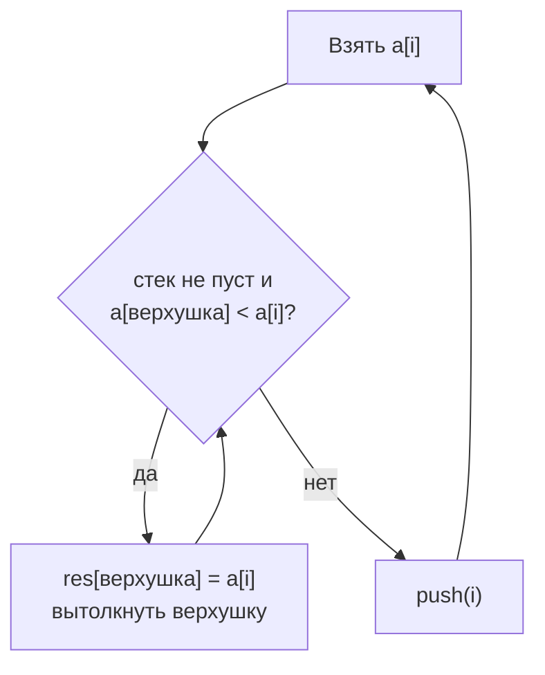
```mermaid
flowchart TD
    A["Взять a[i]"] --> B{"стек не пуст и<br/>a[верхушка] < a[i]?"}
    B -- "да" --> C["res[верхушка] = a[i]<br/>вытолкнуть верхушку"]
    C --> B
    B -- "нет" --> D["push(i)"]
    D --> A
```

### 7.2. Очередь и дек

`container/list` даёт двусвязный список общего назначения, но для дека чисел проще и
быстрее использовать слайс с индексами начала/конца или `container/list` только при
частых вставках в середину. Для скользящего минимума/максимума удобен **монотонный дек**:

```go
package main

import "fmt"

// maxSlidingWindow возвращает максимум в каждом окне размера k.
func maxSlidingWindow(nums []int, k int) []int {
	var deque []int // хранит индексы, nums[deque] убывает
	var res []int

	for i, v := range nums {
		for len(deque) > 0 && nums[deque[len(deque)-1]] <= v {
			deque = deque[:len(deque)-1]
		}
		deque = append(deque, i)

		if deque[0] <= i-k {
			deque = deque[1:]
		}
		if i >= k-1 {
			res = append(res, nums[deque[0]])
		}
	}
	return res
}

func main() {
	fmt.Println(maxSlidingWindow([]int{1, 3, -1, -3, 5, 3, 6, 7}, 3))
	// [3 3 5 5 6 7]
}
```

Сложность `O(n)`: каждый индекс добавляется и удаляется из дека не более одного раза.

**Как это работает.** Дек хранит индексы **кандидатов на максимум** текущего окна, и
значения по этим индексам убывают от начала дека к концу — значит, максимум окна всегда
лежит в начале (`deque[0]`). При добавлении нового элемента `v` все элементы в хвосте
дека, которые меньше `v`, уже никогда не станут максимумом (левее них есть `v`,
который и больше, и "живёт" дольше) — их выталкивают. Затем из начала дека убирают индексы,
которые выпали из окна (`deque[0] <= i-k`). Так голова дека всегда актуальный максимум.

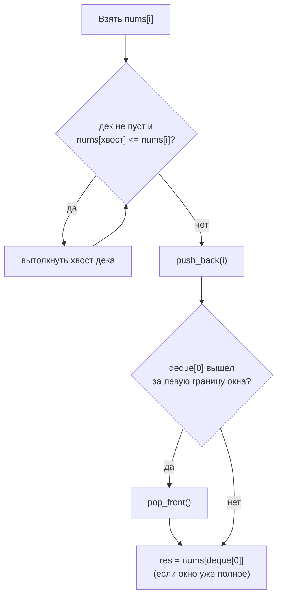
```mermaid
flowchart TD
    A["Взять nums[i]"] --> B{"дек не пуст и<br/>nums[хвост] <= nums[i]?"}
    B -- "да" --> C["вытолкнуть хвост дека"]
    C --> B
    B -- "нет" --> D["push_back(i)"]
    D --> E{"deque[0] вышел<br/>за левую границу окна?"}
    E -- "да" --> F["pop_front()"]
    F --> G["res = nums[deque[0]]<br/>(если окно уже полное)"]
    E -- "нет" --> G
```

### 7.3. Куча (приоритетная очередь)

В Go куча реализуется через интерфейс `container/heap` поверх слайса.

```go
package main

import (
	"container/heap"
	"fmt"
)

type MinHeap []int

func (h MinHeap) Len() int            { return len(h) }
func (h MinHeap) Less(i, j int) bool  { return h[i] < h[j] }
func (h MinHeap) Swap(i, j int)       { h[i], h[j] = h[j], h[i] }
func (h *MinHeap) Push(x interface{}) { *h = append(*h, x.(int)) }
func (h *MinHeap) Pop() interface{} {
	old := *h
	n := len(old)
	item := old[n-1]
	*h = old[:n-1]
	return item
}

func main() {
	h := &MinHeap{5, 2, 8, 1}
	heap.Init(h)
	heap.Push(h, 3)

	for h.Len() > 0 {
		fmt.Println(heap.Pop(h)) // 1 2 3 5 8
	}
}
```

**Типичные применения кучи:** k наименьших/наибольших элементов, алгоритм Дейкстры,
объединение k отсортированных списков, задача "минимальная стоимость соединения верёвок".

**Как это работает.** `container/heap` — не готовая структура данных, а набор функций
(`heap.Init`, `heap.Push`, `heap.Pop`), которые поддерживают инвариант кучи над **вашим**
типом, реализующим интерфейс `sort.Interface` (`Len`, `Less`, `Swap`) плюс `Push`/`Pop`.
Куча хранится как обычный слайс, но интерпретируется как двоичное дерево: элемент с
индексом `i` — родитель элементов `2i+1` и `2i+2`. Инвариант — у родителя значение не
больше (для min-кучи), чем у детей. `heap.Push`/`heap.Pop` поддерживают этот инвариант за
`O(log n)`, "просеивая" элемент вверх или вниз по дереву.

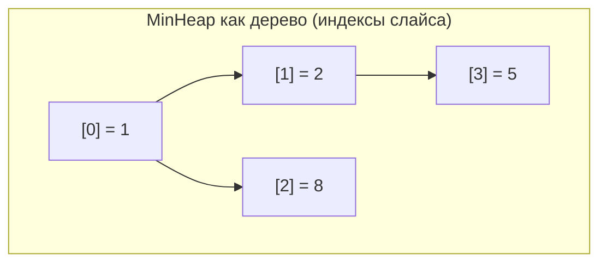
```mermaid
flowchart TD
    subgraph "MinHeap как дерево (индексы слайса)"
    N0["[0] = 1"] --> N1["[1] = 2"]
    N0 --> N2["[2] = 8"]
    N1 --> N3["[3] = 5"]
    end
```

Массив `{1, 2, 8, 5}` соответствует этому дереву: у каждого родителя значение не больше,
чем у детей, — инвариант min-кучи соблюдён. `heap.Pop` всегда возвращает корень (минимум),
затем ставит на его место последний элемент и "просеивает" его вниз, восстанавливая
инвариант.

### 7.4. DSU (Disjoint Set Union / Union-Find)

Нужна для задач на связность: "объединить группы", "проверить, в одной ли компоненте",
динамическое построение графа с запросами связности. С эвристиками (сжатие пути + союз по
рангу) операции работают почти за `O(1)` (точнее — `O(α(n))`, обратная функция Аккермана).

```go
package main

import "fmt"

type DSU struct {
	parent []int
	rank   []int
}

func NewDSU(n int) *DSU {
	d := &DSU{parent: make([]int, n), rank: make([]int, n)}
	for i := range d.parent {
		d.parent[i] = i
	}
	return d
}

func (d *DSU) Find(x int) int {
	if d.parent[x] != x {
		d.parent[x] = d.Find(d.parent[x]) // сжатие пути
	}
	return d.parent[x]
}

func (d *DSU) Union(a, b int) bool {
	ra, rb := d.Find(a), d.Find(b)
	if ra == rb {
		return false // уже в одной компоненте
	}
	if d.rank[ra] < d.rank[rb] {
		ra, rb = rb, ra
	}
	d.parent[rb] = ra
	if d.rank[ra] == d.rank[rb] {
		d.rank[ra]++
	}
	return true
}

func main() {
	d := NewDSU(5)
	d.Union(0, 1)
	d.Union(1, 2)
	fmt.Println(d.Find(0) == d.Find(2)) // true
	fmt.Println(d.Find(0) == d.Find(3)) // false
}
```

**Как это работает.** Каждый элемент изначально сам себе "родитель" — n изолированных
множеств. `Union(a, b)` находит корни множеств `a` и `b` через `Find` и подвешивает один
корень к другому, объединяя множества. Без оптимизаций дерево может выродиться в длинную
цепочку, и `Find` станет `O(n)`. Две эвристики решают это:
- **сжатие пути** (path compression) — после `Find(x)` все вершины на пути до корня
  перевешиваются прямо на корень, поэтому повторные вызовы почти мгновенны;
- **союз по рангу** (union by rank) — при объединении меньшее (по рангу/высоте) дерево
  подвешивается к большему, а не наоборот, чтобы деревья не росли вглубь без необходимости.

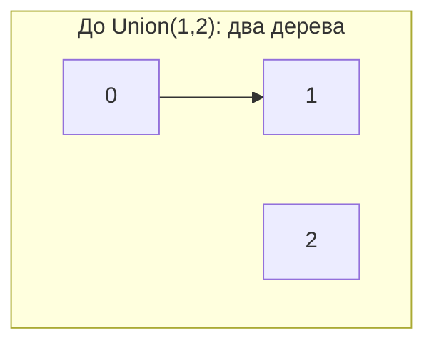
```mermaid
flowchart TD
    subgraph "До Union(1,2): два дерева"
    A0["0"] --> A1["1"]
    A2["2"]
    end
```

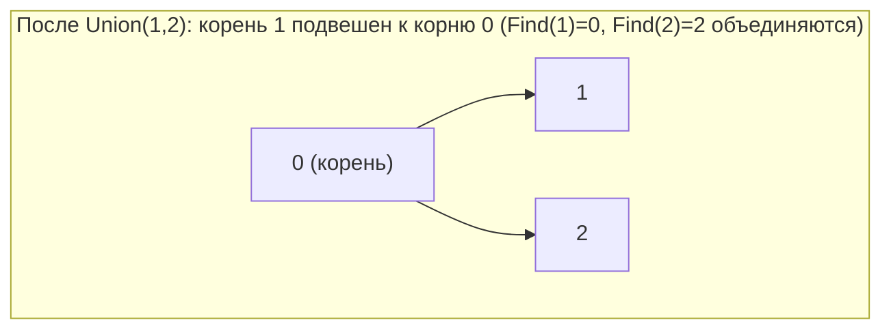
```mermaid
flowchart TD
    subgraph "После Union(1,2): корень 1 подвешен к корню 0 (Find(1)=0, Find(2)=2 объединяются)"
    B0["0 (корень)"] --> B1["1"]
    B0 --> B2["2"]
    end
```

После объединения `Find(0)` и `Find(2)` возвращают один и тот же корень `0` — это и
означает "элементы 0 и 2 в одной компоненте". При следующем `Find(2)` сжатие пути сразу
перевесит 2 напрямую на корень, если путь был длиннее одного шага.

**Классическое применение:** алгоритм Крускала (глава 12), проверка "циклов" при
поэтапном добавлении рёбер, задачи типа "количество компонент после серии объединений".

### 7.5. DSU для поиска "следующего свободного элемента"

Отдельное, менее очевидное применение DSU — не связность, а быстрый пропуск уже
использованных индексов. Нужна, когда на каждом шаге жадного алгоритма требуется "ближайший
ещё не занятый" элемент, а после использования элемент навсегда выбывает.

```go
package main

import "fmt"

// NextFreeDSU: Find(x) возвращает ближайший СВОБОДНЫЙ индекс >= x.
// После использования индекса x его "закрывают" — Use(x).
type NextFreeDSU struct {
	parent []int
}

func NewNextFreeDSU(n int) *NextFreeDSU {
	d := &NextFreeDSU{parent: make([]int, n+1)} // n — "часовой", всегда свободен
	for i := range d.parent {
		d.parent[i] = i
	}
	return d
}

func (d *NextFreeDSU) Find(x int) int {
	for d.parent[x] != x {
		d.parent[x] = d.parent[d.parent[x]] // сжатие пути
		x = d.parent[x]
	}
	return x
}

func (d *NextFreeDSU) Use(x int) {
	d.parent[x] = x + 1
}

func main() {
	d := NewNextFreeDSU(5)
	fmt.Println(d.Find(0)) // 0
	d.Use(0)
	fmt.Println(d.Find(0)) // 1 - индекс 0 уже занят
	d.Use(1)
	fmt.Println(d.Find(0)) // 2
}
```

**Как это работает.** Это DSU, где "множество" — не компонента связности, а цепочка занятых
индексов, которую нужно перепрыгнуть. Изначально каждый индекс — сам себе родитель (свободен).
При `Use(x)` индекс `x` подвешивается к `x+1`: теперь `Find(x)` вместо `x` вернёт `Find(x+1)` —
ближайший свободный индекс справа. Сжатие пути превращает цепочки занятых индексов в почти
прямые ссылки на первый свободный, так что на `n` операций `Use`/`Find` суммарно уходит
`O(n·α(n))` — почти `O(n)` — вместо `O(n^2)` при линейном поиске свободного места каждый раз.

**Типичная связка:** бинарным поиском (`sort.Search`, глава 4.2) находят **позицию** в
отсортированном массиве (например, "первый элемент, больший порога"), а затем `Find` на этой
позиции — чтобы пропустить уже занятые элементы, если несколько запросов попадают на одну и ту
же позицию. Так устроен разбор задачи Codeforces 1114E: на каждом шаге жадно берётся
наименьший ещё не взятый элемент, больший заданного порога — сочетание бинарного поиска по
значению и DSU по использованным индексам даёт `O(n log n)` суммарно вместо `O(n^2)`.

### 7.6. Слияние структур данных "маленькое к большему" (small-to-large)

Приём для задач на дереве, где по каждому узлу нужно посчитать что-то про его поддерево
(например, число различных значений, минимум/максимум набора), обходя дерево снизу вверх и
**переиспользуя** структуры данных детей вместо пересчёта поддерева с нуля.

```go
package main

import "fmt"

// mergeSets объединяет src в dst по принципу "маленькое к большему":
// возвращает бОльшую по размеру мапу, дополненную содержимым меньшей.
func mergeSets(dst, src map[int]bool) map[int]bool {
	if len(dst) < len(src) {
		dst, src = src, dst
	}
	for v := range src {
		dst[v] = true
	}
	return dst
}

// distinctInSubtree считает число различных значений в поддереве каждого узла.
// parent[i] — родитель узла i (parent[0] не используется, 0 — корень).
func distinctInSubtree(n int, a []int, parent []int) []int {
	sets := make([]map[int]bool, n)
	answer := make([]int, n)

	for i := n - 1; i >= 1; i-- {
		if sets[i] == nil {
			sets[i] = map[int]bool{a[i]: true}
		}
		answer[i] = len(sets[i])

		p := parent[i]
		if sets[p] == nil {
			sets[p] = map[int]bool{}
		}
		sets[p] = mergeSets(sets[p], sets[i])
	}
	if sets[0] == nil {
		sets[0] = map[int]bool{}
	}
	sets[0][a[0]] = true
	answer[0] = len(sets[0])

	return answer
}

func main() {
	parent := []int{-1, 0, 0} // узлы 1 и 2 — дети корня 0
	a := []int{5, 5, 7}
	fmt.Println(distinctInSubtree(3, a, parent)) // [2 1 1]
}
```

**Как это работает.** Наивно можно было бы для каждого узла заново обходить всё его
поддерево — `O(n)` на узел, `O(n^2)` суммарно. Вместо этого структура данных **переезжает**: у
каждого узла своя структура (множество, куча, ...), а при подъёме к родителю меньшая
структура сливается в большую (`len(dst) < len(src)` — меняем местами, чтобы всегда вливать
меньшее в большее). Ключевое наблюдение: элемент, оказавшись в структуре размера `k`, после
слияния "меньшее в большее" попадёт в структуру размера не меньше `2k` — то есть структура,
содержащая конкретный элемент, может удвоиться не более `log n` раз за всю работу алгоритма.
Значит суммарное число "перекладываний" элементов по всем слияниям — `O(n log n)`, а не
`O(n^2)`.

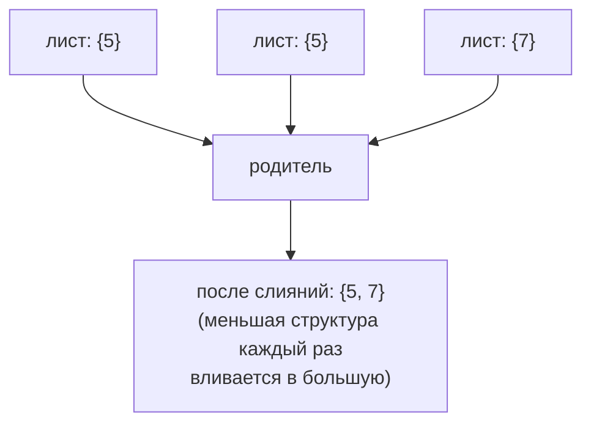
```mermaid
flowchart TD
    L1["лист: {5}"] --> P["родитель"]
    L2["лист: {5}"] --> P
    L3["лист: {7}"] --> P
    P --> R["после слияний: {5, 7}<br/>(меньшая структура каждый раз<br/>вливается в большую)"]
```

**Применение.** Приём работает с любой сливаемой структурой — не только с множеством, но и с
кучей: например, в разборе Codeforces 1114G по дереву снизу вверх сливаются мин-кучи значений
узлов (`mergeHeaps`, "меньшую кучу — в бОльшую"), что даёт суммарную сложность `O(n log n)`
вместо квадратичной. Общее название техники — **small-to-large merging** (иногда встречается
как "DSU on tree" — с классическим DSU из 7.4 её роднит только сам принцип "меньшее к
большему", а не структура данных).

---

## Глава 8. Деревья отрезков и дерево Фенвика

Нужны, когда требуется **и** запрос на отрезке (сумма/минимум/максимум), **и** обновление
элемента, причём вперемешку и много раз (иначе достаточно префиксных сумм из главы 6).

### 8.1. Дерево Фенвика (Binary Indexed Tree)

Простое в реализации дерево для сумм на префиксе/отрезке с точечным обновлением.
Обновление и запрос — `O(log n)`, память — `O(n)`.

```go
package main

import "fmt"

type Fenwick struct {
	tree []int64
	n    int
}

func NewFenwick(n int) *Fenwick {
	return &Fenwick{tree: make([]int64, n+1), n: n}
}

// Add прибавляет delta к элементу с индексом i (0-индексация снаружи).
func (f *Fenwick) Add(i int, delta int64) {
	for i++; i <= f.n; i += i & (-i) {
		f.tree[i] += delta
	}
}

// PrefixSum возвращает сумму a[0..i] включительно.
func (f *Fenwick) PrefixSum(i int) int64 {
	var sum int64
	for i++; i > 0; i -= i & (-i) {
		sum += f.tree[i]
	}
	return sum
}

// RangeSum возвращает сумму a[l..r] включительно.
func (f *Fenwick) RangeSum(l, r int) int64 {
	if l == 0 {
		return f.PrefixSum(r)
	}
	return f.PrefixSum(r) - f.PrefixSum(l-1)
}

func main() {
	f := NewFenwick(6)
	vals := []int64{1, 2, 3, 4, 5, 6}
	for i, v := range vals {
		f.Add(i, v)
	}
	fmt.Println(f.RangeSum(1, 3)) // 2+3+4 = 9
	f.Add(1, 10)                  // a[1] += 10
	fmt.Println(f.RangeSum(1, 3)) // 19
}
```

Также дерево Фенвика легко расширяется для "минимума на префиксе" (но не произвольного
отрезка минимума без дополнительных трюков — для минимума на произвольном отрезке лучше
использовать дерево отрезков или sparse table).

**Как это работает.** Массив `tree` хранит не сами элементы, а суммы специально
подобранных диапазонов, определяемых через двоичное представление индекса: `tree[i]`
отвечает за диапазон длиной `i & (-i)` ("младший установленный бит" индекса, он же
`lowbit`), заканчивающийся в позиции `i`. `Add(i, delta)` идёт от `i` вверх, прибавляя
`delta` во все узлы `tree`, диапазон которых накрывает позицию `i` — переход к следующему
узлу через `i += i & (-i)`. `PrefixSum(i)` идёт от `i` вниз, суммируя непересекающиеся
диапазоны, целиком покрывающие `[0, i]`, — переход через `i -= i & (-i)`. Оба прохода
делают не больше `log n` шагов, потому что двоичное представление индекса теряет/получает
один бит за шаг.

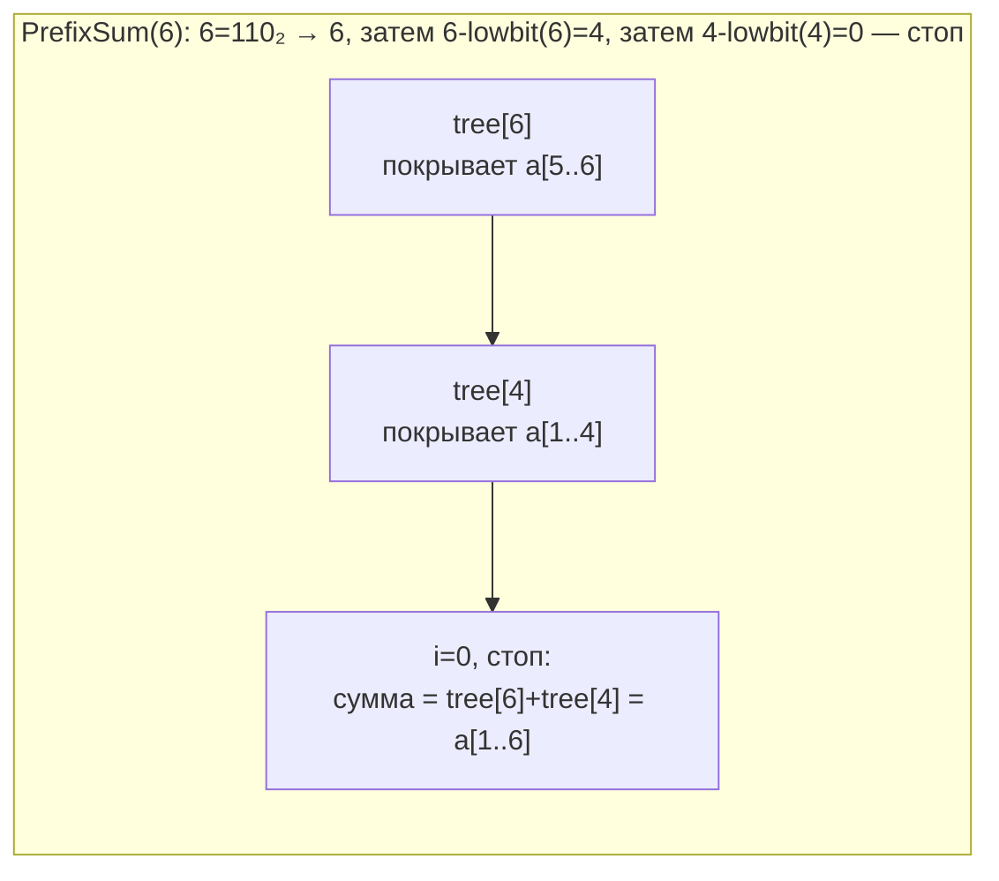
```mermaid
flowchart LR
    subgraph "PrefixSum(6): 6=110₂ → 6, затем 6-lowbit(6)=4, затем 4-lowbit(4)=0 — стоп"
    T6["tree[6]<br/>покрывает a[5..6]"] --> T4["tree[4]<br/>покрывает a[1..4]"]
    T4 --> Stop["i=0, стоп:<br/>сумма = tree[6]+tree[4] = a[1..6]"]
    end
```

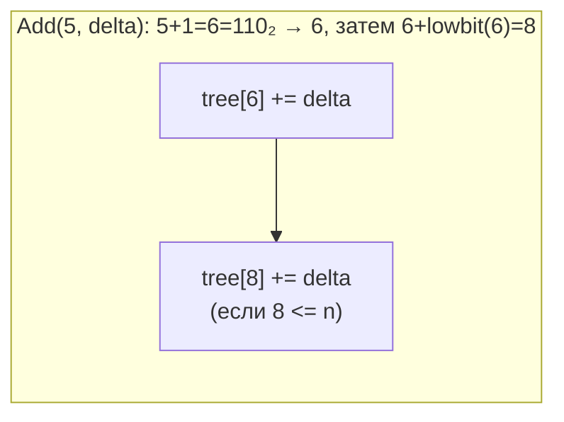
```mermaid
flowchart LR
    subgraph "Add(5, delta): 5+1=6=110₂ → 6, затем 6+lowbit(6)=8"
    U6["tree[6] += delta"] --> U8["tree[8] += delta<br/>(если 8 <= n)"]
    end
```

### 8.2. Дерево отрезков (Segment Tree)

Универсальнее Фенвика: поддерживает сумму/минимум/максимум/GCD и др. на отрезке с
точечным или отрезковым обновлением (с ленивым распространением). Строится за `O(n)`,
запрос/обновление — `O(log n)`.

```go
package main

import "fmt"

type SegTree struct {
	n    int
	tree []int64 // минимум на отрезке; для суммы поменяйте merge на сложение
}

func NewSegTree(a []int) *SegTree {
	n := len(a)
	st := &SegTree{n: n, tree: make([]int64, 4*n)}
	if n > 0 {
		st.build(a, 1, 0, n-1)
	}
	return st
}

func merge(l, r int64) int64 {
	if l < r {
		return l
	}
	return r
}

func (st *SegTree) build(a []int, node, l, r int) {
	if l == r {
		st.tree[node] = int64(a[l])
		return
	}
	mid := (l + r) / 2
	st.build(a, node*2, l, mid)
	st.build(a, node*2+1, mid+1, r)
	st.tree[node] = merge(st.tree[node*2], st.tree[node*2+1])
}

// Update меняет значение в позиции pos на val.
func (st *SegTree) Update(pos int, val int64) {
	st.update(1, 0, st.n-1, pos, val)
}

func (st *SegTree) update(node, l, r, pos int, val int64) {
	if l == r {
		st.tree[node] = val
		return
	}
	mid := (l + r) / 2
	if pos <= mid {
		st.update(node*2, l, mid, pos, val)
	} else {
		st.update(node*2+1, mid+1, r, pos, val)
	}
	st.tree[node] = merge(st.tree[node*2], st.tree[node*2+1])
}

// Query возвращает минимум на отрезке [ql, qr].
func (st *SegTree) Query(ql, qr int) int64 {
	return st.query(1, 0, st.n-1, ql, qr)
}

const inf = int64(1) << 62

func (st *SegTree) query(node, l, r, ql, qr int) int64 {
	if qr < l || r < ql {
		return inf
	}
	if ql <= l && r <= qr {
		return st.tree[node]
	}
	mid := (l + r) / 2
	return merge(
		st.query(node*2, l, mid, ql, qr),
		st.query(node*2+1, mid+1, r, ql, qr),
	)
}

func main() {
	a := []int{5, 2, 8, 1, 9, 3}
	st := NewSegTree(a)
	fmt.Println(st.Query(1, 4)) // min(2,8,1,9) = 1
	st.Update(3, 100)           // a[3] = 100
	fmt.Println(st.Query(1, 4)) // min(2,8,100,9) = 2
}
```

**Как это работает.** Дерево отрезков — двоичное дерево, где каждый узел отвечает за
некоторый отрезок массива `[l, r]`: корень — за весь массив, а его дети рекурсивно делят
этот отрезок пополам, пока не дойдут до листьев (отрезков длины 1, отдельных элементов).
В узле хранится агрегат (в примере — минимум) по всему его отрезку, вычисленный как
`merge` агрегатов двух детей. `build` рекурсивно строит дерево снизу вверх — `O(n)`. Само
дерево хранится не как структура с указателями, а как массив: узел `node` имеет детей
`node*2` и `node*2+1` — тот же приём, что и в куче (глава 7.3).

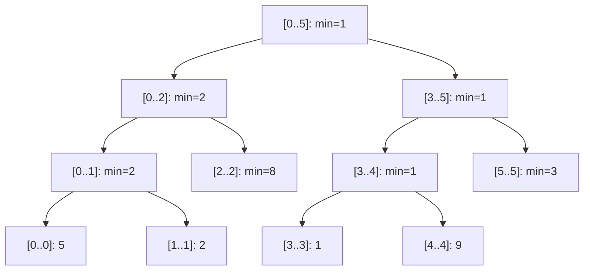
```mermaid
flowchart TD
    Root["[0..5]: min=1"] --> L["[0..2]: min=2"]
    Root --> R["[3..5]: min=1"]
    L --> L1["[0..1]: min=2"]
    L --> L2["[2..2]: min=8"]
    R --> R1["[3..4]: min=1"]
    R --> R2["[5..5]: min=3"]
    L1 --> L1a["[0..0]: 5"]
    L1 --> L1b["[1..1]: 2"]
    R1 --> R1a["[3..3]: 1"]
    R1 --> R1b["[4..4]: 9"]
```

`Update(pos, val)` спускается к листу `pos`, меняет его значение, а на обратном пути наверх
пересчитывает `merge` у всех предков — `O(log n)`, потому что высота дерева `log n`.
`Query(ql, qr)` рекурсивно спускается по дереву и на каждом узле проверяет три случая:
отрезок узла целиком вне `[ql, qr]` — возвращает нейтральный элемент (не влияет на
`merge`); отрезок узла целиком внутри `[ql, qr]` — сразу отдаёт готовый агрегат узла, не
спускаясь глубже; отрезок узла пересекается частично — рекурсивно идёт в обоих детей и
объединяет результаты. Благодаря второму случаю (ранний возврат для полностью покрытых
узлов) запрос тоже укладывается в `O(log n)`, а не обходит всё дерево.

**Как выбрать между Фенвиком и деревом отрезков:**
- Нужна только сумма с точечным обновлением → Фенвик (короче код).
- Нужен минимум/максимум, или обновление отрезка целиком, или более сложная операция →
  дерево отрезков (при обновлении отрезков — с ленивым распространением, lazy propagation).

---

## Глава 9. Жадные алгоритмы

Жадный алгоритм на каждом шаге делает локально оптимальный выбор, надеясь получить
глобально оптимальное решение. **Работает не всегда** — обязательно нужно доказательство
(через обмен аргументов — exchange argument, или индукцию), иначе велик риск получить
неверный, но "правдоподобный" ответ.

### 9.1. Признаки, что жадность сработает

- Задача имеет **свойство жадного выбора**: локально лучший вариант всегда входит в
  какое-то оптимальное решение.
- Задача имеет **оптимальную подструктуру**: оптимальное решение состоит из оптимальных
  решений подзадач.
- Часто помогает сортировка по какому-то критерию перед жадным проходом.

### 9.2. Классическая задача: непересекающиеся отрезки (Activity Selection)

Дано n отрезков (интервалов), нужно выбрать максимальное количество непересекающихся.
**Жадная идея:** сортируем по правому концу и всегда берём отрезок с наименьшим правым
концом, который не пересекается с уже выбранными.

```go
package main

import (
	"fmt"
	"sort"
)

type Interval struct{ start, end int }

func maxNonOverlapping(intervals []Interval) int {
	sort.Slice(intervals, func(i, j int) bool {
		return intervals[i].end < intervals[j].end
	})

	count := 0
	lastEnd := -1 << 62
	for _, iv := range intervals {
		if iv.start >= lastEnd {
			count++
			lastEnd = iv.end
		}
	}
	return count
}

func main() {
	intervals := []Interval{{1, 3}, {2, 4}, {3, 5}, {6, 8}, {5, 7}}
	fmt.Println(maxNonOverlapping(intervals)) // 3
}
```

Доказательство корректности (кратко): если оптимальное решение не содержит отрезок с
минимальным правым концом, его всегда можно заменить на него без потери количества
отрезков — значит, жадный выбор безопасен.

**Как это работает.** После сортировки по правому концу проход идёт слева направо и
хранит `lastEnd` — конец последнего выбранного отрезка. Очередной отрезок берётся только
если его начало не раньше `lastEnd`, то есть он не пересекается с уже выбранными. Взяв
отрезок с наименьшим доступным правым концом на каждом шаге, мы оставляем максимум
свободного места справа для будущих отрезков — в этом суть жадности.

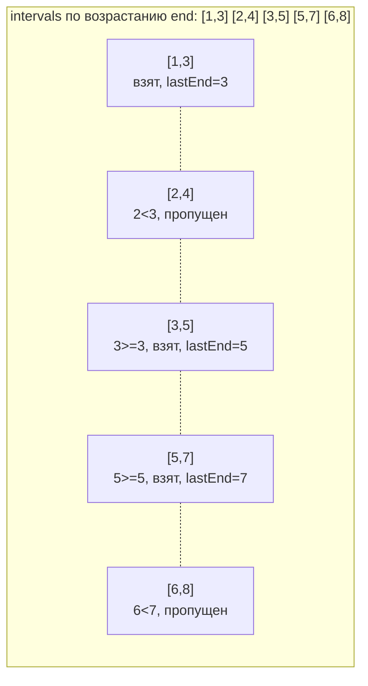
```mermaid
flowchart LR
    subgraph "intervals по возрастанию end: [1,3] [2,4] [3,5] [5,7] [6,8]"
    I1["[1,3]<br/>взят, lastEnd=3"] -.- I2["[2,4]<br/>2<3, пропущен"]
    I2 -.- I3["[3,5]<br/>3>=3, взят, lastEnd=5"]
    I3 -.- I4["[5,7]<br/>5>=5, взят, lastEnd=7"]
    I4 -.- I5["[6,8]<br/>6<7, пропущен"]
    end
```

Итог: 3 непересекающихся отрезка — `[1,3]`, `[3,5]`, `[5,7]`.

### 9.3. Другая классика: монеты (жадность работает не всегда!)

Для "канонической" системы монет (1, 5, 10, 25 — как в США) жадный алгоритм "брать
наибольший номинал, который помещается" даёт минимальное число монет. Но для произвольной
системы номиналов (например, {1, 3, 4}, сумма 6) жадность **ошибается**: жадно возьмём
4+1+1 = 3 монеты, а оптимально 3+3 = 2 монеты. В таких задачах **нужно ДП** (глава 10), а
не жадность — это классическая ловушка на олимпиадах.

### 9.4. Как проверить жадную идею перед тем, как писать код

1. Придумайте контрпример вручную на маленьких данных (3–6 элементов).
2. Если контрпример не находится за 5 минут — вероятно, жадность работает, но постарайтесь
   сформулировать словами, почему локальный выбор не может испортить глобальный оптимум.
3. Если сомневаетесь — на контесте можно закодить и жадность, и ДП-перебор (brute force)
   и сверить ответы на случайных маленьких тестах (stress-testing).

---

## Глава 10. Динамическое программирование

ДП применяется, когда задачу можно разбить на **перекрывающиеся подзадачи** с
**оптимальной подструктурой**: ответ на большую подзадачу выражается через ответы на
меньшие. Два способа реализации: **memoization** (рекурсия + кэш) и **табуляция**
(итеративное заполнение таблицы).

### 10.1. Как распознать ДП-задачу

- В условии просят найти **количество способов**, **минимум/максимум** при ограничениях,
  **возможность/невозможность** сделать что-то.
- Жадный подход не проходит контрпримеры (глава 9.3).
- Задачу можно параметризовать состоянием (например, "первые i элементов и текущая сумма
  j") так, что количество различных состояний разумно (укладывается в лимиты памяти/времени
  из главы 3).

### 10.2. Одномерное ДП: задача о рюкзаке (0/1 Knapsack)

Дано n предметов с весом `w[i]` и ценностью `v[i]`, вместимость рюкзака `W`. Найти
максимальную суммарную ценность при ограничении на суммарный вес.

Состояние: `dp[j]` — максимальная ценность при вместимости `j`. Обновление весов **в
обратном порядке**, чтобы не использовать один и тот же предмет дважды.

```go
package main

import "fmt"

func knapsack01(weights, values []int, W int) int {
	dp := make([]int, W+1)
	for i := range weights {
		w, v := weights[i], values[i]
		for j := W; j >= w; j-- {
			if dp[j-w]+v > dp[j] {
				dp[j] = dp[j-w] + v
			}
		}
	}
	return dp[W]
}

func main() {
	weights := []int{2, 3, 4, 5}
	values := []int{3, 4, 5, 6}
	fmt.Println(knapsack01(weights, values, 5)) // 7 (предметы с весом 2 и 3)
}
```

Сложность: `O(n·W)` по времени, `O(W)` по памяти (оптимизация с двумерного `dp[i][j]` до
одномерного `dp[j]`).

**Как это работает.** Изначально `dp[j]` — лучшая ценность при вместимости `j`, если ещё
не рассмотрен ни один предмет (везде 0). При рассмотрении предмета `i` для каждой
вместимости `j` есть выбор: не брать предмет (`dp[j]` остаётся как было) или взять его
(`dp[j-w]+v`, если влезает). Цикл по `j` идёт **от `W` вниз до `w`**, а не наоборот: если
бы шли по возрастанию, `dp[j-w]` могло бы уже учитывать этот же предмет `i`, взятый
повторно, — это превратило бы 0/1-рюкзак в рюкзак с неограниченным числом копий предмета.
Обратный порядок гарантирует, что `dp[j-w]` на момент обновления `dp[j]` — это ещё
значение "без предмета `i`".

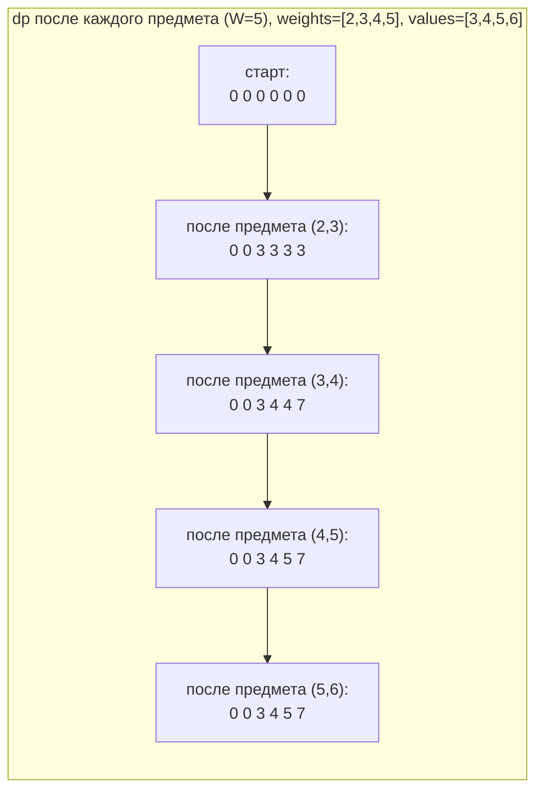
```mermaid
flowchart LR
    subgraph "dp после каждого предмета (W=5), weights=[2,3,4,5], values=[3,4,5,6]"
    S0["старт:<br/>0 0 0 0 0 0"] --> S1["после предмета (2,3):<br/>0 0 3 3 3 3"]
    S1 --> S2["после предмета (3,4):<br/>0 0 3 4 4 7"]
    S2 --> S3["после предмета (4,5):<br/>0 0 3 4 5 7"]
    S3 --> S4["после предмета (5,6):<br/>0 0 3 4 5 7"]
    end
```

Индексы 0..5 — вместимость `j`. Финальное `dp[5] = 7` — предметы с весом 2 и 3.

### 10.3. Двумерное ДП: наибольшая общая подпоследовательность (LCS)

```go
package main

import "fmt"

func lcs(a, b string) int {
	n, m := len(a), len(b)
	dp := make([][]int, n+1)
	for i := range dp {
		dp[i] = make([]int, m+1)
	}

	for i := 1; i <= n; i++ {
		for j := 1; j <= m; j++ {
			if a[i-1] == b[j-1] {
				dp[i][j] = dp[i-1][j-1] + 1
			} else if dp[i-1][j] > dp[i][j-1] {
				dp[i][j] = dp[i-1][j]
			} else {
				dp[i][j] = dp[i][j-1]
			}
		}
	}
	return dp[n][m]
}

func main() {
	fmt.Println(lcs("ABCBDAB", "BDCABA")) // 4 ("BCBA" или "BDAB")
}
```

Сложность: `O(n·m)` по времени и памяти. При больших n, m (>10^4) память `O(n·m)` может
не влезть — тогда применяют оптимизацию "скользящей строки" (храним только 2 последние
строки), сводя память к `O(m)`.

**Как это работает.** `dp[i][j]` — длина LCS для префиксов `a[0..i)` и `b[0..j)`. Если
последние символы этих префиксов совпадают (`a[i-1] == b[j-1]`), они точно входят в LCS,
и ответ на единицу длиннее LCS без этих символов: `dp[i-1][j-1] + 1`. Если не совпадают,
общая подпоследовательность не может использовать оба последних символа сразу, значит,
берём лучшее из "отбросить последний символ `a`" (`dp[i-1][j]`) и "отбросить последний
символ `b`" (`dp[i][j-1]`).

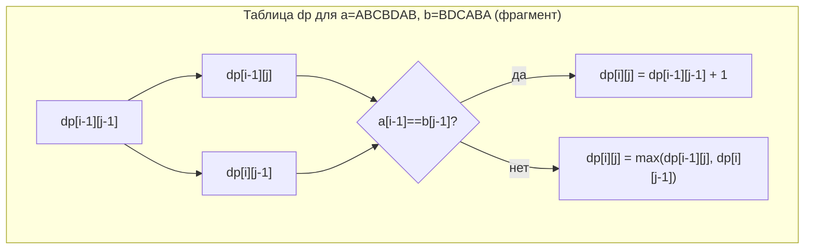
```mermaid
flowchart TD
    subgraph "Таблица dp для a=ABCBDAB, b=BDCABA (фрагмент)"
    D00["dp[i-1][j-1]"] --> D01["dp[i-1][j]"]
    D00 --> D10["dp[i][j-1]"]
    D01 --> D11{"a[i-1]==b[j-1]?"}
    D10 --> D11
    D11 -- "да" --> V1["dp[i][j] = dp[i-1][j-1] + 1"]
    D11 -- "нет" --> V2["dp[i][j] = max(dp[i-1][j], dp[i][j-1])"]
    end
```

Каждая ячейка зависит только от соседа сверху, слева и по диагонали — поэтому таблицу
можно заполнять построчно, и для экономии памяти достаточно хранить только две последние
строки.

### 10.4. ДП на подотрезках (Interval DP): умножение матриц

Классика: за какой минимальной стоимостью можно расставить скобки при перемножении цепочки
матриц. Состояние `dp[i][j]` — минимальная стоимость перемножить матрицы с i по j.

```go
package main

import "fmt"

func matrixChainOrder(p []int) int {
	n := len(p) - 1 // количество матриц
	dp := make([][]int, n+1)
	for i := range dp {
		dp[i] = make([]int, n+1)
	}

	for length := 2; length <= n; length++ {
		for i := 1; i <= n-length+1; i++ {
			j := i + length - 1
			dp[i][j] = 1 << 62
			for k := i; k < j; k++ {
				cost := dp[i][k] + dp[k+1][j] + p[i-1]*p[k]*p[j]
				if cost < dp[i][j] {
					dp[i][j] = cost
				}
			}
		}
	}
	return dp[1][n]
}

func main() {
	p := []int{40, 20, 30, 10, 30} // 4 матрицы с такими размерностями
	fmt.Println(matrixChainOrder(p)) // 26000
}
```

Сложность: `O(n^3)` по времени, `O(n^2)` по памяти — типичная граница для Interval DP,
допустимая при `n ≤ 300–500` (см. таблицу главы 3).

**Как это работает.** `dp[i][j]` — минимальная стоимость перемножить матрицы с `i` по `j`
как единую цепочку. Чтобы её посчитать, перебираем точку разреза `k` — последнюю матрицу
"левой половины" цепочки: тогда стоимость равна "стоимость левой половины" (`dp[i][k]`) +
"стоимость правой половины" (`dp[k+1][j]`) + стоимость финального перемножения результатов
этих двух половин (`p[i-1]*p[k]*p[j]`, по размерностям объединяемых матриц). Отличие от
LCS в том, что таблица заполняется не по строкам, а **по длине отрезка** `length`: чтобы
посчитать `dp[i][j]` для отрезка длины `L`, нужны уже готовые `dp` для всех более коротких
отрезков внутри `[i, j]` — поэтому внешний цикл идёт по `length`, а не по `i`.

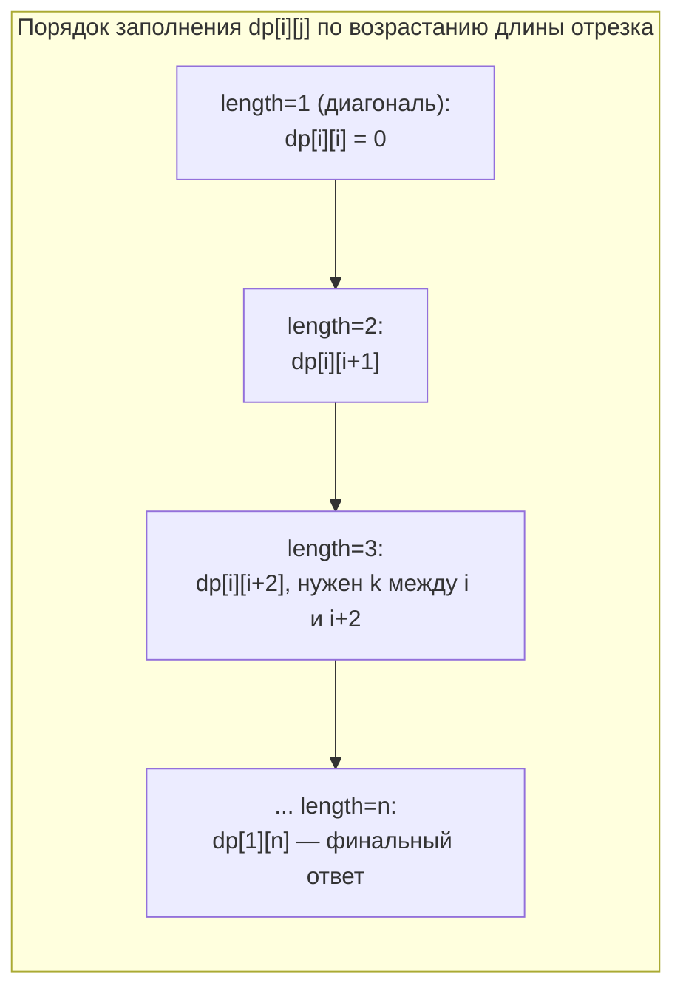
```mermaid
flowchart LR
    subgraph "Порядок заполнения dp[i][j] по возрастанию длины отрезка"
    Len1["length=1 (диагональ):<br/>dp[i][i] = 0"] --> Len2["length=2:<br/>dp[i][i+1]"]
    Len2 --> Len3["length=3:<br/>dp[i][i+2], нужен k между i и i+2"]
    Len3 --> LenN["... length=n:<br/>dp[1][n] — финальный ответ"]
    end
```

Внутренний цикл по `k` перебирает все точки разреза отрезка `[i,j]` и берёт минимум — это
и даёт `O(n^3)`: `O(n^2)` пар `(i,j)`, умноженное на `O(n)` вариантов `k` для каждой пары.

### 10.5. Восстановление ответа (не только значения, но и самого решения)

Часто просят вывести не только оптимальное значение, но и сам набор выбранных элементов
(путь). Для этого при заполнении `dp` дополнительно храните "откуда пришли" (родителя), а
затем восстанавливайте путь с конца:

```go
// Пример: восстановление списка выбранных предметов для 0/1 Knapsack
func knapsackWithItems(weights, values []int, W int) (int, []int) {
	n := len(weights)
	dp := make([][]int, n+1)
	for i := range dp {
		dp[i] = make([]int, W+1)
	}

	for i := 1; i <= n; i++ {
		w, v := weights[i-1], values[i-1]
		for j := 0; j <= W; j++ {
			dp[i][j] = dp[i-1][j]
			if j >= w && dp[i-1][j-w]+v > dp[i][j] {
				dp[i][j] = dp[i-1][j-w] + v
			}
		}
	}

	// Восстановление выбранных предметов
	var chosen []int
	j := W
	for i := n; i > 0; i-- {
		if dp[i][j] != dp[i-1][j] {
			chosen = append(chosen, i-1)
			j -= weights[i-1]
		}
	}
	return dp[n][W], chosen
}
```

**Как это работает.** Здесь используется двумерная (не сжатая до одной строки) таблица
`dp[i][j]`, где `i` — "рассмотрены первые `i` предметов". Это специально: чтобы понять,
взят ли предмет `i`, достаточно сравнить `dp[i][j]` с `dp[i-1][j]` — если они различаются,
значит, обновление при рассмотрении предмета `i` сработало, то есть предмет был выгодно
взять, и нужно перейти к `j -= weights[i-1]` (мы "вычитаем" его вклад) и рассматривать
предмет `i-1`. Если значения равны — предмет `i` не улучшил ответ, пропускаем его и просто
переходим к `i-1` с тем же `j`. Проход идёт с конца (`i = n` до `1`), потому что
восстановление всегда обратно направлению заполнения таблицы.

---

## Глава 11. Графы: обходы и кратчайшие пути

### 11.1. Представление графа

Для олимпиад чаще всего используют список смежности:

```go
type Graph struct {
	adj [][]int
}

func NewGraph(n int) *Graph {
	return &Graph{adj: make([][]int, n)}
}

func (g *Graph) AddEdge(u, v int) {
	g.adj[u] = append(g.adj[u], v)
	g.adj[v] = append(g.adj[v], u) // для неориентированного графа
}
```

Для взвешенного графа — список пар `(сосед, вес)`.

### 11.2. BFS — кратчайший путь в невзвешенном графе

```go
package main

import "fmt"

func bfs(adj [][]int, start int) []int {
	n := len(adj)
	dist := make([]int, n)
	for i := range dist {
		dist[i] = -1
	}
	dist[start] = 0

	queue := []int{start}
	for len(queue) > 0 {
		v := queue[0]
		queue = queue[1:]
		for _, to := range adj[v] {
			if dist[to] == -1 {
				dist[to] = dist[v] + 1
				queue = append(queue, to)
			}
		}
	}
	return dist
}

func main() {
	adj := make([][]int, 6)
	edges := [][2]int{{0, 1}, {0, 2}, {1, 3}, {2, 3}, {3, 4}, {4, 5}}
	for _, e := range edges {
		adj[e[0]] = append(adj[e[0]], e[1])
		adj[e[1]] = append(adj[e[1]], e[0])
	}
	fmt.Println(bfs(adj, 0)) // [0 1 1 2 3 4]
}
```

**Важно про Go-слайсы как очередь:** `queue = queue[1:]` не освобождает память сразу
(underlying array растёт), для очень больших графов (>10^6 вершин) лучше использовать
индекс `head` вместо пересрезания:

```go
head := 0
for head < len(queue) {
	v := queue[head]
	head++
	// ...
}
```

**Как это работает.** BFS обходит граф "волнами": сначала посещает всех соседей стартовой
вершины (расстояние 1), затем всех их непосещённых соседей (расстояние 2), и так далее.
Очередь гарантирует именно такой порядок — FIFO, "первым пришёл — первым обработан", то
есть вершины обрабатываются строго в порядке возрастания расстояния от старта. Как только
вершина впервые попадает в очередь, её расстояние уже финально — оно не может уменьшиться
позже, потому что все более короткие пути были бы найдены раньше (волна доходит первой).

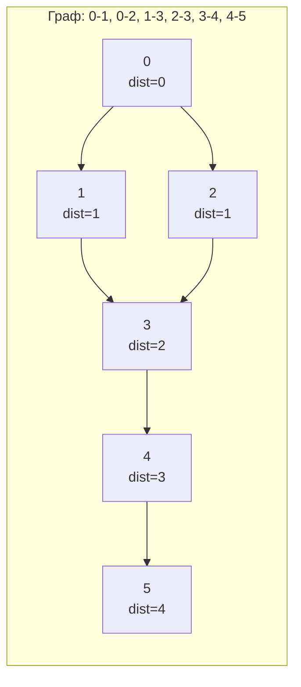
```mermaid
flowchart LR
    subgraph "Граф: 0-1, 0-2, 1-3, 2-3, 3-4, 4-5"
    N0["0<br/>dist=0"] --> N1["1<br/>dist=1"]
    N0 --> N2["2<br/>dist=1"]
    N1 --> N3["3<br/>dist=2"]
    N2 --> N3
    N3 --> N4["4<br/>dist=3"]
    N4 --> N5["5<br/>dist=4"]
    end
```

Каждая вершина посещается один раз, каждое ребро просматривается не более двух раз (по
разу с каждого конца) — отсюда `O(n+m)`.

### 11.3. DFS — обход в глубину

```go
func dfs(adj [][]int, v int, visited []bool) {
	visited[v] = true
	for _, to := range adj[v] {
		if !visited[to] {
			dfs(adj, to, visited)
		}
	}
}
```

**Как это работает.** В отличие от BFS, который расходится "вширь" волнами, DFS уходит
максимально "вглубь" по первому доступному соседу, и только упёршись в тупик (все соседи
уже посещены), возвращается назад (backtracking) и пробует следующую непройденную ветку.
Рекурсия здесь естественно реализует стек вызовов: вызов `dfs(to)` не вернётся, пока не
обойдёт всё, что достижимо из `to`. Используется, когда важен не кратчайший путь, а сам
факт достижимости, порядок входа/выхода из вершин (для топологической сортировки, поиска
циклов, компонент связности) — то есть структура обхода, а не расстояния.

При глубине рекурсии >10^5 переписывайте на итеративный DFS со своим стеком (см. главу
3.3, пункт 5).

### 11.4. Дейкстра — кратчайший путь с неотрицательными весами

```go
package main

import (
	"container/heap"
	"fmt"
)

type Edge struct {
	to, weight int
}

type Item struct {
	node, dist int
}

type PQ []Item

func (pq PQ) Len() int            { return len(pq) }
func (pq PQ) Less(i, j int) bool  { return pq[i].dist < pq[j].dist }
func (pq PQ) Swap(i, j int)       { pq[i], pq[j] = pq[j], pq[i] }
func (pq *PQ) Push(x interface{}) { *pq = append(*pq, x.(Item)) }
func (pq *PQ) Pop() interface{} {
	old := *pq
	n := len(old)
	item := old[n-1]
	*pq = old[:n-1]
	return item
}

const inf = 1 << 62

func dijkstra(adj [][]Edge, start int) []int {
	n := len(adj)
	dist := make([]int, n)
	for i := range dist {
		dist[i] = inf
	}
	dist[start] = 0

	pq := &PQ{{start, 0}}
	for pq.Len() > 0 {
		cur := heap.Pop(pq).(Item)
		v, d := cur.node, cur.dist
		if d > dist[v] {
			continue // устаревшая запись в очереди
		}
		for _, e := range adj[v] {
			nd := d + e.weight
			if nd < dist[e.to] {
				dist[e.to] = nd
				heap.Push(pq, Item{e.to, nd})
			}
		}
	}
	return dist
}

func main() {
	n := 5
	adj := make([][]Edge, n)
	addEdge := func(u, v, w int) {
		adj[u] = append(adj[u], Edge{v, w})
		adj[v] = append(adj[v], Edge{u, w})
	}
	addEdge(0, 1, 4)
	addEdge(0, 2, 1)
	addEdge(2, 1, 2)
	addEdge(1, 3, 1)
	addEdge(2, 3, 5)
	addEdge(3, 4, 3)

	fmt.Println(dijkstra(adj, 0)) // [0 3 1 4 7]
}
```

**Как это работает.** Дейкстра — это BFS, обобщённый на взвешенные рёбра: вместо очереди
FIFO используется приоритетная очередь (куча из главы 7.3), которая всегда отдаёт вершину
с наименьшим известным расстоянием от старта. Когда вершина `v` извлекается из кучи с
расстоянием `d`, это расстояние уже гарантированно минимально (все более короткие пути до
неё были бы обработаны раньше — куча ведь отдаёт наименьшее). Дальше идёт **релаксация**
соседей: для каждого ребра `(v, to, weight)` проверяем, не короче ли путь через `v`, чем
уже известный `dist[to]`, и если короче — обновляем и кладём в кучу. Проверка `d >
dist[v]` в начале цикла отсекает "устаревшие" записи — в кучу могла попасть вершина
несколько раз с разными расстояниями, актуально только первое (наименьшее) извлечение.

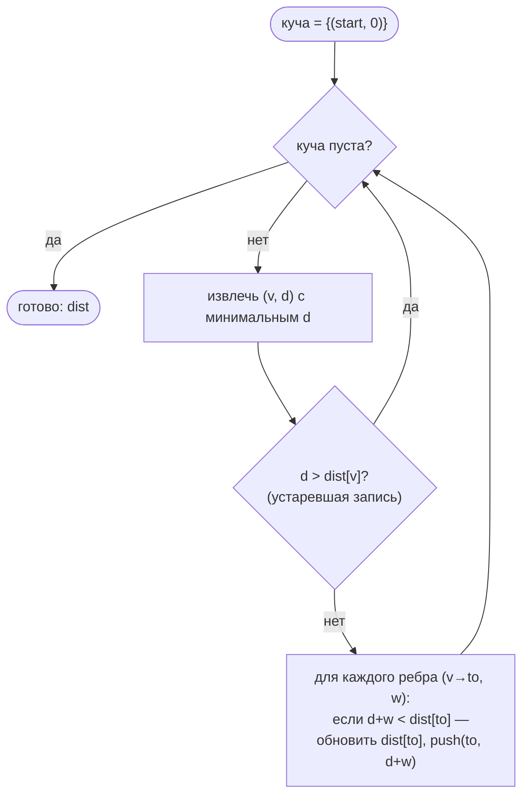
```mermaid
flowchart TD
    Start(["куча = {(start, 0)}"]) --> Pop{"куча пуста?"}
    Pop -- "да" --> Done(["готово: dist"])
    Pop -- "нет" --> Extract["извлечь (v, d) с минимальным d"]
    Extract --> Stale{"d > dist[v]?<br/>(устаревшая запись)"}
    Stale -- "да" --> Pop
    Stale -- "нет" --> Relax["для каждого ребра (v→to, w):<br/>если d+w < dist[to] —<br/>обновить dist[to], push(to, d+w)"]
    Relax --> Pop
```

Отрицательные веса ломают этот инвариант: релаксация могла бы найти более короткий путь
через вершину, которая уже "окончательно" обработана, но Дейкстра назад не возвращается.

Сложность: `O((n+m) log n)` с бинарной кучей — подходит для `n, m ≤ 10^5–10^6`.

**Важно:** Дейкстра **не работает** с отрицательными весами рёбер — там нужен
Беллман–Форд (`O(n·m)`, допустим при n, m ≤ 3000–5000) или, для DAG, топологический
порядок с релаксацией за `O(n+m)`.

---

## Глава 12. Графы: остовные деревья, топология, компоненты

### 12.1. Минимальное остовное дерево: алгоритм Крускала

Используется, когда нужно соединить все вершины рёбрами минимальной суммарной стоимости
без циклов. Работает через сортировку рёбер по весу и DSU (глава 7.4) для проверки цикла.

```go
package main

import (
	"fmt"
	"sort"
)

type Edge struct {
	u, v, weight int
}

func kruskal(n int, edges []Edge) (int, []Edge) {
	sort.Slice(edges, func(i, j int) bool { return edges[i].weight < edges[j].weight })

	dsu := NewDSU(n)
	totalWeight := 0
	var mst []Edge

	for _, e := range edges {
		if dsu.Union(e.u, e.v) {
			totalWeight += e.weight
			mst = append(mst, e)
			if len(mst) == n-1 {
				break
			}
		}
	}
	return totalWeight, mst
}

func main() {
	edges := []Edge{
		{0, 1, 4}, {0, 2, 1}, {2, 1, 2},
		{1, 3, 1}, {2, 3, 5}, {3, 4, 3},
	}
	weight, _ := kruskal(5, edges)
	fmt.Println(weight) // 7
}
```

(Реализация `DSU` — из главы 7.4.) Сложность: `O(m log m)` из-за сортировки.

**Как это работает.** Жадная идея: отсортировав рёбра по весу, идём от самых дешёвых к
самым дорогим и берём ребро, только если оно не создаёт цикл — то есть его концы сейчас в
**разных** компонентах DSU. `dsu.Union` возвращает `true`, если объединение реально
произошло (концы были в разных компонентах), и в этом случае ребро входит в остов. Раз мы
всегда берём самое дешёвое из ещё допустимых рёбер, суммарный вес остова минимален (это и
есть exchange argument из главы 9). Алгоритм останавливается, набрав `n-1` ребро — ровно
столько нужно, чтобы связать `n` вершин в дерево без циклов.

```mermaid
flowchart TD
    A["Отсортировать рёбра по весу"] --> B{"есть ещё рёбра?"}
    B -- "нет" --> Done(["готово: MST"])
    B -- "да" --> C["взять следующее по весу ребро (u,v)"]
    C --> D{"Find(u) == Find(v)?<br/>(уже в одной компоненте)"}
    D -- "да (цикл)" --> B
    D -- "нет" --> E["Union(u,v): добавить ребро в MST"]
    E --> F{"рёбер в MST == n-1?"}
    F -- "да" --> Done
    F -- "нет" --> B
```

### 12.2. Топологическая сортировка (алгоритм Кана)

Применяется в ориентированных ациклических графах (DAG) для задач "порядок выполнения
задач с зависимостями".

```go
package main

import "fmt"

func topologicalSort(n int, adj [][]int) ([]int, bool) {
	indeg := make([]int, n)
	for v := 0; v < n; v++ {
		for _, to := range adj[v] {
			indeg[to]++
		}
	}

	queue := []int{}
	for v := 0; v < n; v++ {
		if indeg[v] == 0 {
			queue = append(queue, v)
		}
	}

	var order []int
	for len(queue) > 0 {
		v := queue[0]
		queue = queue[1:]
		order = append(order, v)
		for _, to := range adj[v] {
			indeg[to]--
			if indeg[to] == 0 {
				queue = append(queue, to)
			}
		}
	}

	return order, len(order) == n // false, если есть цикл
}

func main() {
	n := 6
	adj := make([][]int, n)
	adj[5] = []int{2, 0}
	adj[4] = []int{0, 1}
	adj[2] = []int{3}
	adj[3] = []int{1}

	order, ok := topologicalSort(n, adj)
	fmt.Println(order, ok) // например [4 5 2 0 3 1] true
}
```

Если `ok == false` — в графе есть цикл, топологическая сортировка невозможна (полезно для
детектирования циклов, например, в задачах "могут ли все курсы быть пройдены с учётом
пререквизитов").

**Как это работает.** `indeg[v]` — количество рёбер, входящих в `v` ("сколько
предварительных условий" нужно выполнить перед `v`). В очередь изначально попадают только
вершины без входящих рёбер — их можно выполнить прямо сейчас. Когда вершина `v`
обрабатывается, все рёбра из неё "выполняются": для каждого соседа `to` уменьшаем
`indeg[to]` — как будто вычёркиваем одно из его условий. Как только у `to` не остаётся
невыполненных условий (`indeg[to] == 0`), он тоже готов и попадает в очередь. Если в конце
`order` содержит не все `n` вершин — значит, часть вершин так и не обнулила `indeg`, то
есть они участвуют в цикле и никогда не станут готовы.

```mermaid
flowchart LR
    subgraph "Пример: 5→2, 5→0, 4→0, 4→1, 2→3, 3→1"
    V5["5<br/>indeg=0"] --> V2["2<br/>indeg=1"]
    V5 --> V0["0<br/>indeg=2"]
    V4["4<br/>indeg=0"] --> V0
    V4 --> V1["1<br/>indeg=2"]
    V2 --> V3["3<br/>indeg=1"]
    V3 --> V1
    end
```

Старт: в очереди `{5, 4}` (`indeg=0`). Обработка `5` уменьшает `indeg[2]` до 0 и `indeg[0]`
до 1; обработка `4` уменьшает `indeg[0]` до 0 и `indeg[1]` до 1 — и так далее, пока очередь
не опустеет.

### 12.3. Компоненты связности

Для неориентированного графа — простой DFS/BFS от каждой непосещённой вершины (глава
11.2–11.3) или DSU (глава 7.4), если рёбра добавляются динамически.

```go
func countComponents(n int, adj [][]int) int {
	visited := make([]bool, n)
	count := 0
	for v := 0; v < n; v++ {
		if !visited[v] {
			count++
			dfs(adj, v, visited)
		}
	}
	return count
}
```

Для **сильно связных компонент** в ориентированном графе используется алгоритм Тарьяна
или Косараю (`O(n+m)`) — актуально в задачах о циклах зависимостей в орграфах, здесь мы
только упоминаем название для дальнейшего самостоятельного изучения, если задача требует.

**Как это работает.** Идея простая: каждый обход `dfs` (или `bfs`) из непосещённой
вершины помечает **всю** компоненту, в которой она лежит (все вершины, достижимые из неё
по неориентированным рёбрам). Значит, число запусков `dfs` в основном цикле равно числу
компонент связности — каждый следующий непосещённый `v` обязательно принадлежит новой,
ещё не обойдённой компоненте.

---

## Глава 13. Строки: хэши, префикс- и Z-функции

### 13.1. Полиномиальное хэширование строк

Позволяет сравнивать подстроки за `O(1)` после `O(n)` предпосчёта — полезно для поиска
повторов, сравнения подстрок, проверки на палиндром и т.д.

```go
package main

import "fmt"

type StringHash struct {
	prefixHash []uint64
	pow        []uint64
	base       uint64
	mod        uint64
}

func NewStringHash(s string) *StringHash {
	const base = 131
	const mod = (1 << 61) - 1 // большое простое число (число Мерсенна)

	n := len(s)
	h := &StringHash{
		prefixHash: make([]uint64, n+1),
		pow:        make([]uint64, n+1),
		base:       base,
		mod:        mod,
	}
	h.pow[0] = 1
	for i := 0; i < n; i++ {
		h.prefixHash[i+1] = (h.prefixHash[i]*base + uint64(s[i])) % mod
		h.pow[i+1] = (h.pow[i] * base) % mod
	}
	return h
}

// GetHash возвращает хэш подстроки s[l..r] включительно.
func (h *StringHash) GetHash(l, r int) uint64 {
	res := (h.prefixHash[r+1] + h.mod - (h.prefixHash[l]*h.pow[r-l+1])%h.mod) % h.mod
	return res
}

func main() {
	s := "abcabcabc"
	h := NewStringHash(s)
	fmt.Println(h.GetHash(0, 2) == h.GetHash(3, 5)) // true, "abc" == "abc"
	fmt.Println(h.GetHash(0, 2) == h.GetHash(1, 3)) // false, "abc" != "bca"
}
```

**Важно:** для надёжности на сложных тестах (когда есть противники, специально
подбирающие тесты против хэша) используют **два разных модуля/базы одновременно** и
сравнивают пары хэшей — это снижает вероятность коллизии почти до нуля.

**Как это работает.** Строка интерпретируется как число в системе счисления с основанием
`base`: `hash(s) = s[0]·base^(n-1) + s[1]·base^(n-2) + ... + s[n-1]`, всё по модулю
большого простого `mod` (чтобы число не росло бесконечно, а коллизии были маловероятны).
`prefixHash[i]` — хэш первых `i` символов. Чтобы получить хэш подстроки `s[l..r]`, нужно
"вычесть" вклад префикса `s[0..l)` из хэша `s[0..r]`, но предварительно домножив его на
`base` в нужной степени — ведь позиции символов при этом сдвигаются:

```mermaid
flowchart LR
    subgraph "GetHash(l, r): убрать вклад префикса s[0..l)"
    A["prefixHash[r+1]<br/>= хэш всей s[0..r]"] --> C["минус"]
    B["prefixHash[l] * base^(r-l+1)<br/>= вклад s[0..l), сдвинутый<br/>на длину подстроки"]
    B --> C
    C --> D["хэш s[l..r]"]
    end
```

Массив `pow` — заранее посчитанные степени `base` по модулю, чтобы не пересчитывать их
каждый раз. Так любой запрос сводится к O(1) арифметике по уже готовым префиксным хэшам.

### 13.2. Префикс-функция (используется в KMP)

`pi[i]` — длина наибольшего собственного суффикса подстроки `s[0..i]`, совпадающего с её
префиксом. Используется для поиска подстроки в строке за `O(n+m)` и для нахождения
периодов строки.

```go
package main

import "fmt"

func prefixFunction(s string) []int {
	n := len(s)
	pi := make([]int, n)
	for i := 1; i < n; i++ {
		j := pi[i-1]
		for j > 0 && s[i] != s[j] {
			j = pi[j-1]
		}
		if s[i] == s[j] {
			j++
		}
		pi[i] = j
	}
	return pi
}

// findAll ищет все вхождения pattern в text за O(n+m).
func findAll(text, pattern string) []int {
	combined := pattern + "#" + text
	pi := prefixFunction(combined)

	var res []int
	patLen := len(pattern)
	for i := patLen + 1; i < len(combined); i++ {
		if pi[i] == patLen {
			res = append(res, i-2*patLen)
		}
	}
	return res
}

func main() {
	fmt.Println(findAll("ababcababcabc", "abc")) // [2 7 10]
}
```

**Как это работает.** `pi[i]` отвечает на вопрос: "если совпадение только что оборвалось
на позиции `i`, куда безопасно откатиться, чтобы не начинать сравнение с нуля?". Для
строки `"abcabd"` при `i=5` (символ `d`) префикс `"abcab"` заканчивается на суффикс `"ab"`,
совпадающий с началом строки `"ab..."`, — значит `pi[4] = 2`. Внутренний `while` (`j =
pi[j-1]`) — это и есть тот самый откат: если очередной символ не продолжает текущее
совпадение длины `j`, пробуем более короткое совпадение `pi[j-1]`, пока не найдём символ,
который продолжается, или не дойдём до нуля. Каждый символ строки увеличивает `j` не более
чем на 1 за шаг, а суммарно `j` уменьшается (`while`) не больше раз, чем увеличивается —
отсюда амортизированная сложность `O(n)`.

```mermaid
flowchart LR
    subgraph "s = a b c a b d, pi = [0,0,0,1,2,0]"
    P0["pi[0]=0"] --> P1["pi[1]=0"] --> P2["pi[2]=0"] --> P3["pi[3]=1<br/>(a=a)"] --> P4["pi[4]=2<br/>(ab=ab)"] --> P5["pi[5]=0<br/>(d обрывает)"]
    end
```

`findAll` использует хитрость: склеивает `pattern + "#" + text` (разделитель `#` не
встречается ни в одной строке) и считает `pi` для этой объединённой строки. Как только
`pi[i]` становится равным длине `pattern`, значит, суффикс длины `patLen` в этой позиции
целиком совпал с `pattern` — то есть найдено вхождение, заканчивающееся в позиции `i`.

### 13.3. Z-функция

`z[i]` — длина наибольшего общего префикса строки `s` и её суффикса, начинающегося с
позиции `i`. Тоже решает поиск подстроки, а также удобна для задач на периоды строки и
поиск повторяющихся блоков.

```go
package main

import "fmt"

func zFunction(s string) []int {
	n := len(s)
	z := make([]int, n)
	l, r := 0, 0
	for i := 1; i < n; i++ {
		if i < r {
			z[i] = min(r-i, z[i-l])
		}
		for i+z[i] < n && s[z[i]] == s[i+z[i]] {
			z[i]++
		}
		if i+z[i] > r {
			l, r = i, i+z[i]
		}
	}
	return z
}

func min(a, b int) int {
	if a < b {
		return a
	}
	return b
}

func main() {
	fmt.Println(zFunction("aaabaab")) // [0 2 1 0 2 1 0]
}
```

**Как это работает.** `z[i]` — на сколько символов суффикс, начинающийся в `i`, совпадает
с началом строки. Наивно это считалось бы за `O(n^2)` (сравнивать посимвольно для каждого
`i`), но алгоритм переиспользует уже сделанную работу с помощью **z-блока** `[l, r]` —
самого правого известного отрезка, совпадающего с префиксом строки. Если `i` попадает
внутрь текущего z-блока (`i < r`), то суффикс с позиции `i` уже частично известен из
симметрии внутри блока — можно взять готовое значение `z[i-l]` как нижнюю оценку (не
превышающую оставшуюся длину блока `r-i`) и лишь **дозаписать** сравнение дальше, а не
начинать с нуля. Если `i` вне блока, приходится считать честно посимвольно, зато после
этого блок `[l, r]` сдвигается вправо — суммарно правая граница `r` только растёт, что и
даёт амортизированную `O(n)`.

```mermaid
flowchart LR
    subgraph "s = a a a b a a b, z = [_,2,1,0,2,1,0]"
    S["s[0..6] = a a a b a a b"]
    Z1["z[1]=2:<br/>s[1..2]='aa' = s[0..1]"]
    Z4["z[4]=2:<br/>s[4..5]='aa' = s[0..1]"]
    end
```

Z-функцию используют для поиска подстроки так же, как и префикс-функцию: склеивают
`pattern + "#" + text` и ищут позиции, где `z[i] == len(pattern)` — это и есть вхождения.

**Выбор между хэшами, префикс-функцией и Z-функцией:** если нужно только один раз найти
все вхождения шаблона — KMP или Z-функция (стабильные `O(n+m)`, без вероятности коллизий).
Если нужно много разных сравнений подстрок в разных местах — строковые хэши гибче и
быстрее в применении для сложных задач (например, бинарный поиск по длине общего
префикса двух подстрок).

---

## Глава 14. Комбинаторика и теория чисел

### 14.1. Быстрое возведение в степень (по модулю)

Нужно почти в каждой задаче на подсчёт количества способов по модулю простого числа
(обычно `10^9+7`).

```go
package main

import "fmt"

const mod = 1_000_000_007

func power(base, exp int64) int64 {
	base %= mod
	result := int64(1)
	for exp > 0 {
		if exp&1 == 1 {
			result = result * base % mod
		}
		base = base * base % mod
		exp >>= 1
	}
	return result
}

// Обратный элемент по модулю простого числа (малая теорема Ферма).
func modInverse(a int64) int64 {
	return power(a, mod-2)
}

func main() {
	fmt.Println(power(2, 10))     // 1024
	fmt.Println(modInverse(2))    // (10^9+8)/2 mod p
}
```

Сложность: `O(log exp)`.

**Как это работает.** Наивное возведение в степень умножает `base` само на себя `exp` раз
— `O(exp)`. Бинарное возведение представляет `exp` в двоичном виде и использует тождество
`base^exp = base^(b0·2^0) · base^(b1·2^1) · base^(b2·2^2) · ...`, где `b_i` — биты `exp`.
Переменная `base` на каждом шаге возводится в квадрат (значение `base^(2^k)` для растущего
`k`), а `result` домножается на неё только если соответствующий бит `exp` равен 1.

```mermaid
flowchart LR
    subgraph "power(x, 13): 13 = 1101₂"
    E0["exp=13 (1101)<br/>бит 1 → result *= x^1"] --> E1["exp=6 (110)<br/>бит 0 → пропуск, x=x^2"]
    E1 --> E2["exp=3 (11)<br/>бит 1 → result *= x^4"]
    E2 --> E3["exp=1 (1)<br/>бит 1 → result *= x^8"]
    E3 --> E4["exp=0 → стоп"]
    end
```

Итог: `x^13 = x^1 · x^4 · x^8` — ровно те степени двойки, что закодированы единицами в
13 = 1101₂. Число шагов равно числу битов `exp`, отсюда `O(log exp)` вместо `O(exp)`.

`modInverse` использует малую теорему Ферма: для простого `mod` и `a`, не делящегося на
`mod`, верно `a^(mod-1) ≡ 1 (mod mod)`, значит `a^(mod-2)` — обратный элемент к `a`
(деление по модулю простого числа сводится к умножению на этот обратный элемент).

### 14.2. Биномиальные коэффициенты по модулю

Предпосчёт факториалов и обратных факториалов позволяет считать `C(n, k)` за `O(1)` после
`O(n)` подготовки.

```go
package main

import "fmt"

const mod = 1_000_000_007
const maxN = 1_000_001

var fact, invFact [maxN]int64

func power(base, exp int64) int64 {
	base %= mod
	result := int64(1)
	for exp > 0 {
		if exp&1 == 1 {
			result = result * base % mod
		}
		base = base * base % mod
		exp >>= 1
	}
	return result
}

func precomputeFactorials() {
	fact[0] = 1
	for i := 1; i < maxN; i++ {
		fact[i] = fact[i-1] * int64(i) % mod
	}
	invFact[maxN-1] = power(fact[maxN-1], mod-2)
	for i := maxN - 2; i >= 0; i-- {
		invFact[i] = invFact[i+1] * int64(i+1) % mod
	}
}

func binomial(n, k int) int64 {
	if k < 0 || k > n {
		return 0
	}
	return fact[n] * invFact[k] % mod * invFact[n-k] % mod
}

func main() {
	precomputeFactorials()
	fmt.Println(binomial(5, 2)) // 10
}
```

**Важно про память:** массивы фиксированного размера `maxN` в глобальной области — это
`O(maxN)`, при `maxN = 10^6` и `int64` — это ~8 МБ на массив, вполне укладывается в лимит.

**Как это работает.** `C(n,k) = n! / (k! · (n-k)!)`, но по модулю простого числа деление
не определено напрямую — вместо него умножают на **обратный элемент** (глава 14.1). Считать
`modInverse` для каждого факториала по отдельности было бы `O(log mod)` на вызов; вместо
этого `invFact` считается один раз для самого большого факториала (`power(fact[maxN-1],
mod-2)`), а все меньшие `invFact[i]` получаются из следующего за `O(1)`: раз `fact[i+1] =
fact[i] · (i+1)`, то и `invFact[i] = invFact[i+1] · (i+1)` — обратный элемент произведения
это произведение обратных. Поэтому проход по `invFact` идёт **с конца к началу**. После
такой подготовки за `O(maxN)` каждый запрос `binomial(n,k)` — это три умножения по модулю,
то есть `O(1)`.

### 14.3. Решето Эратосфена

Находит все простые числа до n за `O(n log log n)` — существенно быстрее наивной проверки
делимости `O(n·√n)`.

```go
package main

import "fmt"

func sieve(n int) []bool {
	isPrime := make([]bool, n+1)
	for i := range isPrime {
		isPrime[i] = true
	}
	isPrime[0], isPrime[1] = false, false

	for i := 2; i*i <= n; i++ {
		if isPrime[i] {
			for j := i * i; j <= n; j += i {
				isPrime[j] = false
			}
		}
	}
	return isPrime
}

func main() {
	primes := sieve(30)
	for i, p := range primes {
		if p {
			fmt.Print(i, " ")
		}
	}
	// 2 3 5 7 11 13 17 19 23 29
}
```

**Как это работает.** Массив `isPrime` изначально считает все числа простыми. Проход по
`i` от 2: если `i` ещё не вычеркнуто, значит, у него нет делителей меньше него самого — оно
простое, и тогда все его кратные (2i, 3i, 4i, ...) точно составные, их вычёркиваем.
Внутренний цикл стартует с `i*i`, а не с `2*i` — все меньшие кратные `i` (`2i, 3i, ...,
(i-1)*i`) уже были вычеркнуты как кратные меньших простых чисел ранее. Внешний цикл идёт
только до `i*i <= n`, потому что если `n` составное, у него обязательно есть делитель
`≤ √n`.

```mermaid
flowchart LR
    subgraph "Решето до 30: вычёркивание кратных 2, 3, 5"
    A["i=2: вычеркнуть 4,6,8,...,30"] --> B["i=3: вычеркнуть 9,12,15,...,30"]
    B --> C["i=5: вычеркнуть 25,30<br/>(меньшие кратные 5 уже вычеркнуты 2 и 3)"]
    C --> D["i=6..: 6*6=36>30, стоп<br/>оставшиеся невычеркнутые — простые"]
    end
```

### 14.4. НОД, НОК

```go
func gcd(a, b int) int {
	for b != 0 {
		a, b = b, a%b
	}
	return a
}

func lcm(a, b int) int {
	return a / gcd(a, b) * b
}
```

**Как это работает.** Алгоритм Евклида основан на тождестве `gcd(a, b) = gcd(b, a mod b)`:
общий делитель `a` и `b` — это и общий делитель `b` и остатка `a mod b` (остаток — это
`a` минус несколько раз `b`, а общий делитель обеих величин не меняется при вычитании).
Пара `(a, b)` заменяется на `(b, a mod b)` до тех пор, пока `b` не станет нулём — тогда
`a` и есть искомый НОД. `lcm(a,b) = a·b / gcd(a,b)` — тождество, следующее из того, что
`a·b` содержит `gcd(a,b)` как множитель дважды (по разу от каждого числа).

Сложность `gcd` — `O(log(min(a, b)))` (алгоритм Евклида).

### 14.5. Проверка на переполнение

В Go `int` на 64-битных системах — это фактически `int64`, диапазон до ~9.2·10^18. Тем не
менее при перемножении двух чисел порядка `10^9` (например, `n*n` при `n ~ 10^9`)
результат `~10^18` всё ещё влезает, но **три** таких множителя (`n^3 ~ 10^27`) уже
переполняют `int64` — здесь нужно либо брать модуль по ходу вычислений, либо использовать
`math/big`. Переполнение — частый источник WA (Wrong Answer) на олимпиадах, всегда
прикидывайте максимальное промежуточное значение.

### 14.6. Битовые операции: инварианты и XOR-трюки

```go
package main

import "fmt"

// totalXOR возвращает XOR всех элементов массива — O(n).
func totalXOR(a []int) int {
	x := 0
	for _, v := range a {
		x ^= v
	}
	return x
}

func main() {
	fmt.Println(totalXOR([]int{4, 2, 4, 3, 2})) // 3 — "непарный" элемент
}
```

**Ключевые свойства XOR**, на которых строятся такие трюки:
- `a ^ a = 0`, `a ^ 0 = a` — операция сама себе обратна: применив её дважды с одним и тем же
  значением, получаем исходное состояние;
- коммутативность и ассоциативность — порядок применения не важен, поэтому XOR всего массива
  можно поддерживать инкрементально при любых перестановках и любом порядке операций;
- элемент, встретившийся **чётное число раз**, "гасится" в общем XOR — отсюда классика "найти
  единственный неповторяющийся элемент среди пар" за `O(n)` времени и `O(1)` памяти (пример
  выше), без сортировки и без хэш-таблицы.

**Приём "инвариант операции".** Если каждая допустимая операция над массивом предсказуемо
меняет некоторую величину (например, общий XOR) на известное значение, эту величину можно
использовать, чтобы **вычислить**, какая именно операция была применена, не перебирая все
варианты. Так устроен разбор задачи Codeforces 1114F: операция с индексом `i` заменяет `a_j`
на `a_j XOR a_i` для всех `j != i`, что меняет суммарный XOR массива ровно на `a_i` (XOR
применяется к `n-1` элементам — при чётном `n` это нечётное число раз, поэтому вклад `a_i` не
гасится). Значит, если массив `a` должен был превратиться в `b` ровно одной такой операцией,
единственный кандидат на использованный элемент — это

```go
x := totalXOR(a) ^ totalXOR(b)
```

и остаётся проверить его за `O(n)`, вместо перебора всех `n` возможных индексов операции с
последующей проверкой каждого варианта (`O(n^2)`).

**Другие типовые применения XOR:** проверка чётности количества элементов с заданным
свойством; компактное хранение подмножества (`bitmask`, где `i`-й бит — "элемент `i`
выбран"), что часто используется в ДП по подмножествам (см. главу 10); префиксные XOR-суммы
как аналог префиксных сумм из главы 6, но с XOR вместо `+` — тоже обратимая операция, поэтому
"сумма на отрезке" считается как `prefixXOR[r] ^ prefixXOR[l-1]`.

---

## Глава 15. Заключение и план подготовки

### 15.1. Итоговая схема принятия решения

```
Прочитать условие
    │
    ├─ Понять входные данные и что нужно найти
    ├─ Оценить ограничения n, m, лимит времени/памяти (глава 3)
    ├─ Сопоставить формулировку с таблицей ключевых слов (глава 2.2)
    │
    ├─ Граф? ──────────► BFS/DFS, Дейкстра, MST, топосортировка (главы 11-12)
    ├─ Строки? ────────► Хэши, префикс-/Z-функция (глава 13)
    ├─ Запросы на отрезке с обновлениями? ► Fenwick / SegTree (глава 8)
    ├─ Перекрывающиеся подзадачи? ─────► ДП (глава 10)
    ├─ Монотонный предикат по значению? ► Бинарный поиск по ответу (глава 4.3)
    ├─ Окно/подотрезок с монотонным условием? ► Два указателя (глава 5)
    ├─ "Похоже на жадность"? ───► Найти контрпример; если нет — доказать и брать (глава 9)
    ├─ Подсчёт способов / числа? ► Комбинаторика, модульная арифметика (глава 14)
    │
    └─ Написать решение → прикинуть сложность по таблице (глава 3.1)
                        → протестировать на примерах из условия
                        → проверить граничные случаи (n=0,1; переполнение; пустой ввод)
```

### 15.2. Как тренироваться дальше

1. Решайте задачи по возрастанию рейтинга на Codeforces (начните с Div. 2 A/B, рейтинг
   800–1200), закрепляя каждую главу этой книги отдельной подборкой задач.
2. После решения — читайте разборы (editorials) даже для решённых задач: часто есть более
   изящное решение.
3. Заведите личную библиотеку шаблонов кода на Go (DSU, SegTree, Dijkstra, хэши строк) —
   на контесте это экономит десятки минут.
4. Практикуйте **stress-testing**: пишите наивное решение (`O(n^2)` или перебор) и
   сравнивайте со "быстрым" решением на случайных маленьких тестах — так ловится
   большинство логических ошибок до сдачи.
5. Ведите заметки об ошибках (переполнение, забытый `mod`, неверная граница бинарного
   поиска) — они повторяются у всех и со временем перестанут повторяться у вас.

Удачи на соревнованиях!
